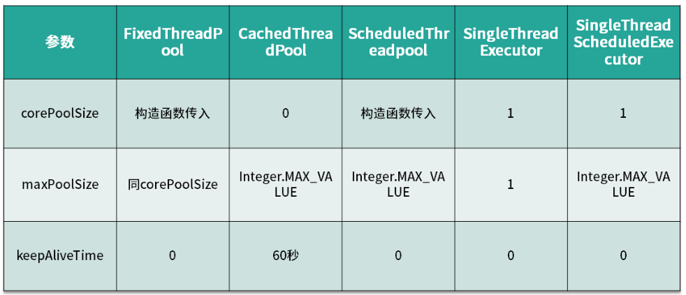
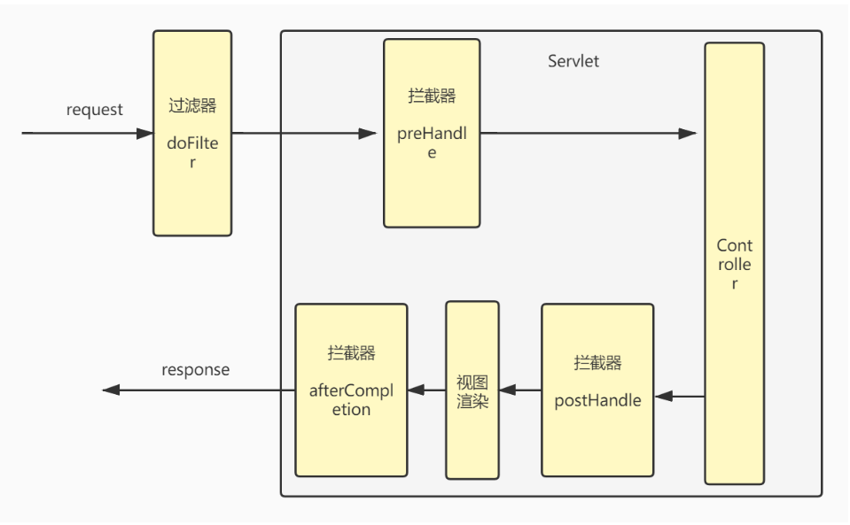
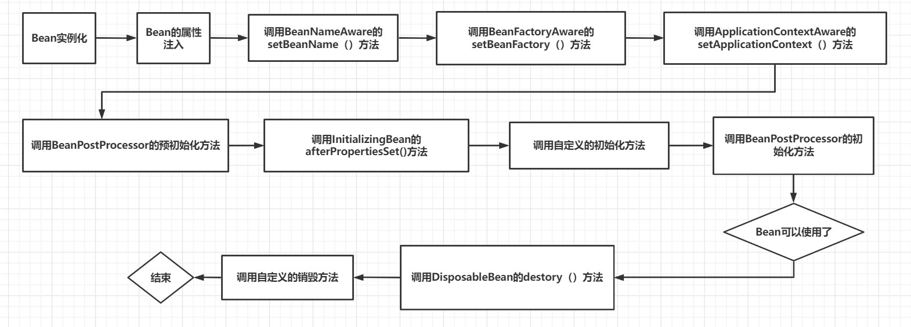
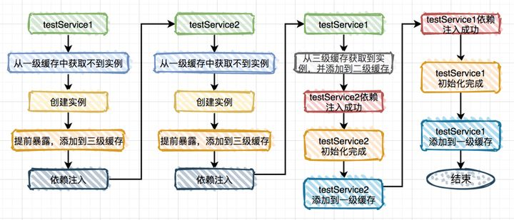
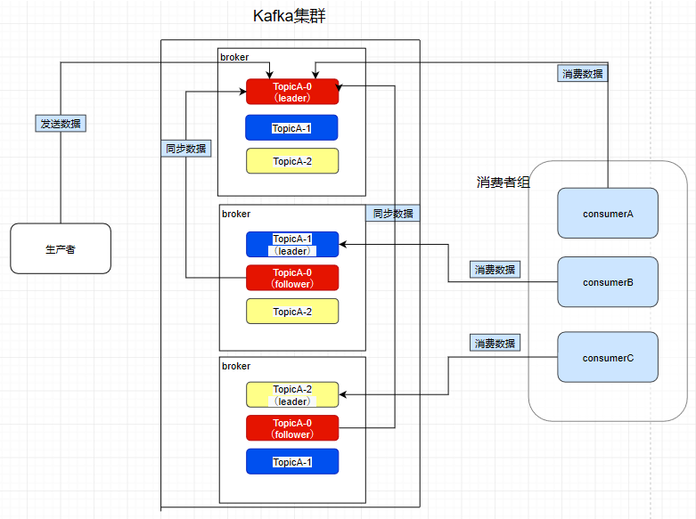
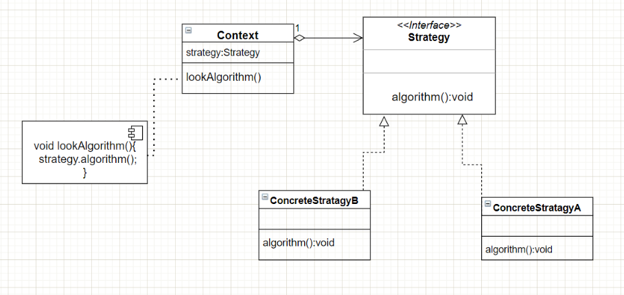
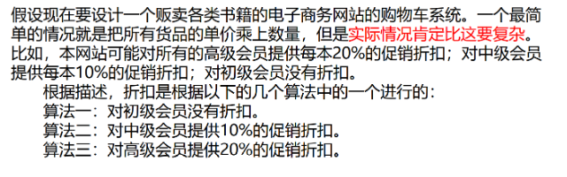

18K 冲冲冲


## JVM

### 说一下 JVM 的主要组成部分及其作用？


图解，java JVM包含两个子系统，（类加载子系统跟执行引擎），两个组件（运行时数据区域，本地库接口）

首先通过类加载器（ClassLoader）会把 Java 代码转换成字节码

运行时数据区（Runtime Data Area）再把字节码加载到内存中

而字节码文件只是 JVM 的一套指令集规范，并不能直接交给底层操作系统去执行，因此需要特定的命令解析器执行引擎（Execution Engine），将字节码翻译成底层系统指令，再交由 CPU 去执行

而这个过程中需要调用其他语言的本地库接口（Native Interface）来实现整个程序的功能。


### ⭐⭐⭐[说一下 JVM 运行时数据区？](https://www.cnblogs.com/aiqiqi/p/10770864.html)


#### 程序计数器

当前线程所执行的字节码行号指示器，字节码解析器的工作是通过改变这个计数器的值，来选取下一条需要执行的字节码指令，分支，循环，跳转，等都要依靠程序计数器，它是一块较小的内存空间，且是**线程私有**的。

程序计数器是唯不会出现 OutOfMemoryError 的内存区域，它的生命周期随着线程的创建而创建，随着线程的结束而死亡。

1，字节码解释器通过改变程序计数器来依次读取指令，从而实现代码的流程控制，如：顺序执行、选择、循环、异常处理。

2，在多线程的情况下，程序计数器用于记录当前线程执行的位置，从而当线程被切换回来的时候能够知道该线程上次运行到哪儿了。


#### java虚拟机栈

虚拟机栈**是线程私有的**，他的生命周期和线程的生命周期是一致的。里面装的是一个一个的**栈帧**，每一个方法在执行的时候都会创建一个栈帧，栈帧中用来存放（**局部变量表**、**操作数栈** 、**动态链接** 、**返回地址**）

- **局部变量表：**局部变量表是一组变量值存储空间，用来存放方法参数、方法内部定义的**局部变量**。底层是变量槽（variable slot）
- **操作数栈：**是用来记录一个方法在执行的过程中，字节码指令向操作数栈中进行入栈和出栈的过程。大小在编译的时候已经确定了，当一个方法刚开始执行的时候，操作数栈中是空发的，在方法执行的过程中会有各种字节码指令往操作数栈中入栈和出栈。
- **动态链接：**因为字节码文件中有很多符号的引用，这些符号引用一部分会在类加载的解析阶段或第一次使用的时候转化成直接引用，这种称为静态解析；另一部分会在运行期间转化为直接引用，称为动态链接。
- **返回地址（returnAddress）：**存放调用方法的程序计数器。执行引擎遇到一个方法返回的字节码指令(return)，这时候可能会有返回值传递给上层的方法调用者，这种退出方式称为正常完成出口。异常退出 ： 在方法执行过程中遇到了异常，并且没有处理这个异常，就会导致方法退出。一般来说，方法正常退出时，调用者的PC计数器的值可以作为返回地址，栈帧中会保存这个计数器值，而方法异常退出时，返回地址要通过异常处理器表来确定的，栈帧中一般不会保存这部分信息


Java 虚拟机栈也是线程私有的，每个线程都有各自的Java虚拟机栈，而且随着线程的创建而创建，随着线程的死亡而死亡。


StackOverFlowError：若Java虚拟机栈的内存大小不允许动态扩展，那么当线程请求栈的深度超过当前Java虚拟机栈的最大深度的时候就抛出StackOverFlowError异常。（如果线程请求的栈深度大于虚拟机所允许的深度）

OutOfMemoryError：若 Java 虚拟机栈的内存大小允许动态扩展，且当线程请求栈时内存用完了，无法再动态扩展了，此时抛出OutOfMemoryError异常。（如果虚拟机栈动态扩展时无法申请到足够的内存）


#### ⭐⭐⭐java 堆

Java虚拟机中内存最大的一块，被所有**线程共享**，几乎所有对象实例在这里分配内存，静态对象放在堆

Java 堆是垃圾收集器管理的主要区域，因此也被称作GC堆（Garbage Collected Heap）。从垃圾回收的角度，由于现在收集器基本都采用分代垃圾收集算法


JDK1.7

新生代（Young Generation）：大多数对象在新生代中被创建，其中很多对象的生命周期很短。每次新生代的垃圾回收（又称Minor GC）后只有少量对象存活，所以选用复制算法，只需要少量的复制成本就可以完成回收。

新生代内又分三个区：一个Eden区，两个Survivor区（一般而言），大部分对象在Eden区中生成

当Eden区满时，还存活的对象将被复制到两个Survivor区（中的一个From区）。

当这个Survivor区满时，此区的存活且不满足"晋升"条件的对象将被复制到另外一个Survivor TO区。

对象每经历一次Minor GC，年龄加1，达到"晋升年龄阈值"后，被放到老年代，这个过程也称为"晋升"。

晋升年龄阈值"的大小直接影响着对象在新生代中的停留时间，在Serial和ParNew GC两种回收器中,晋升年龄阈值通过参数MaxTenuringThreshold设定，默认值为15。

老年代（Old Generation）：在新生代中经历了N次垃圾回收后仍然存活的对象，就会被放到年老代，该区域中对象存活率高。

老年代的垃圾回收（又称Major GC）通常使用"标记-清理"或"标记-整理"算法 。

永久代（Perm Generation）：主要存放元数据，例如Class、Method的元信息，与垃圾回收要回收的Java对象关系不大。相对于新生代和年老代来说，该区域的划分对垃圾回收影响比较小。


JDK 1.8

在 JDK 1.8中移除整个永久代，取而代之的是一个叫元空间（Metaspace）的区域

永久代使用的是JVM的堆内存空间，而元空间使用的是物理内存，直接受到本机的物理内存限制

为什么要放弃永久代？ 永久代空间不够用，常常会内存溢出


#### 本地方法栈

与虚拟机栈的作用是一样的，只不过虚拟机栈是服务 Java 方法的，而本地方法栈是为虚拟机调用 Native 方法服务的；

本地方法被执行的时候，在本地方法栈也会创建一个栈帧，用于存放该本地方法的局部变量表、操作数栈、动态链接、出口信息。方法执行完毕后相应的栈帧也会出栈并释放内存空间，也会出现 StackOverFlowError 和 OutOfMemoryError 两种异常。


#### 方法区

用 对于JVM的方法区也可以称之为永久区，它储存的是已经被java虚拟机加载的类信息、常量、静态变量；Jdk1.8以后取消了方法区这个概念，称之为元空间（MetaSpace）；

 当应用中的 Java 类过多时，比如 **Spring 等一些使用动态代理的框架生成了很多类**，如果占用空间超出了我们的设定值，就会发生**元空间溢出**


线程私有的：程序计数器，虚拟机栈，本地方法栈 线程共享的：堆，方法区，直接内存


### 堆内存分配策略

- **对象优先分配在Eden区**

  如果Eden区没有足够的空间进行分配时，虚拟机执行一次MinorGC。而那些无需回收的存活对象，将会进到 Survivor 的 From 区（From 区内存不足时，直接进入 Old 区）。

- **大对象直接进入老年代**（需要大量连续内存空间的对象）

  这样做的目的是避免在Eden区和两个Survivor区之间发生大量的内存拷贝（新生代采用复制算法收集内存）。

- **长期存活的对象进入老年代**

  虚拟机为每个对象定义了一个年龄（Age Count）计数器，如果对象经过了1次Minor GC那么对象会进入Survivor区，之后每经过一次Minor GC那么对象的年龄加1，直到达到阀值（默认15次），对象进入老年区。

  （**动态对象年龄判定**：程序从年龄最小的对象开始累加，如果累加的对象大小，大于幸存区的一半，则将当前的对象 age 作为新的阈值，年龄大于此阈值的对象则直接进入老年代）

- **空间分配担保**

  在发生Minor GC之前，虚拟机会先检查Survivor空间是否够用，如果够用则直接进行Minor GC。否则进行检查**老年代最大连续可用空间是否大于新生代的总和**，假如大于，那么这个时候发生Minor GC是安全的。假如不大于，那么需要判断HandlePromotionFailure设置是否允许担保失败。假如允许，则继续判定老年代最大可用的连续空间是否大于平均晋升到老年代对象的平均值，如果大于，这个时候可以发生Minor GC ，如果小于或者设置HandlePromotionFailure不允许担保失败，则需要做一次Full GC。通常会把HandlePromotionFailure开关打开，以减少Full GC。

- 每次进行Minor GC或者大对象直接进入老年区时，JVM会计算所需空间大小如小于老年区的剩余值大小，则进行一次**Full GC**。

  

  （Minor GC， Major GC，Full GC后面详解）

  

### ⭐⭐⭐说一下类装载的执行过程？


**加载**：加载指的是将类的class文件读入到内存中，并为之创建一个java.lang.Class对象。

类的加载由类加载器完成，类加载器由JVM提供，开发者也可以通过继承ClassLoader基类来创建自己的类加载器。

通过使用不同的类加载器可以从不同来源加载类的二进制数据，通常有如下几种来源：

- 从本地文件系统加载
- 从jar包加载	
- 通过网络加载	
- 把一个Java源文件动态编译，并执行加载

**验证**：检查加载的 class 文件的正确性；大致分为以下四个阶段


**准备**：给类中的静态变量分配内存空间，并赋予默认初始值，给常量赋值。常见的数据类型的默认值如下

| 数据类型  | 默认值   |
| :-------- | :------- |
| byte      | (byte)0  |
| short     | (short)0 |
| int       | 0        |
| long      | 0L       |
| float     | 0.0f     |
| double    | 0.0d     |
| boolean   | false    |
| char      | '\u0000' |
| reference | null     |

**解析**：虚拟机将常量池中的符号引用替换成直接引用的过程。符号引用就理解为一个标示，而在直接引用直接指向内存中的地址；


**初始化**：对静态变量和静态代码块执行初始化工作。

验证，准备，解析统称为连接阶段，也就是类加载分为加载，连接，初始化三个阶段。


### ⭐⭐⭐创建一个对象的步骤

**步骤：类加载检查、分配内存、初始化零值、设置对象头、执行init方法**

**①类加载检查：**

 虚拟机遇到 new 指令时，⾸先去检查是否能在常量池中定位到这个类的符号引⽤，并且检查这个符号引⽤代表的类是否已被加载过、解析和初始化过。如果没有，那必须先执⾏相应的类加载过程。

**②分配内存：**

 在类加载检查通过后，接下来虚拟机将为新⽣对象分配内存，分配⽅式有 **“指针碰撞”** 和 **“空闲列表”** 两种，选择那种分配⽅式由 Java 堆是否规整决定，⽽Java堆是否规整⼜由所采⽤的垃圾收集器是否带有压缩整理功能决定。

**③初始化零值：**

 内存分配完成后，虚拟机需要将分配到的内存空间都初始化为零值，这⼀步操作保证了对象的实例字段在 Java 代码中可以不赋初始值就直接使⽤，程序能访问到这些字段的数据类型所对应的零值。

**④设置对象头：**

 初始化零值完成之后，虚拟机要对对象进⾏必要的设置，例如这个对象是那个类的实例、如何才能找到类的元数据信息、对象的哈希吗、对象的 GC 分代年龄等信息。 这些信息存放在对象头中。 另外，根据虚拟机当前运⾏状态的不同，如是否启⽤**偏向锁**等，对象头会有不同的设置⽅式。

**⑤执⾏ init ⽅法：**

 从虚拟机的视⻆来看，⼀个新的对象已经产⽣了，但从Java 程序的视⻆来看， ⽅法还没有执⾏，所有的字段都还为零。所以⼀般来说（除循环依赖），执⾏ new 指令之后会接着执⾏init⽅法，初始化成员变量，执行实例化代码块，调用类的构造方法，并把堆内对象的首地址赋值给引用变量，这样⼀个真正可⽤的对象才算产⽣出来。


### ⭐⭐⭐双亲委派机制

每⼀个类都有⼀个对应它的类加载器，系统中的 ClassLoder 在协同⼯作的时候会默认使⽤ 双亲委派模型 。

即在类加载的时候，系统会⾸先判断当前类是否被加载过，已经被加载的类会直接返回，否则才会尝试加载。

加载的时候，⾸先会把该请求委派该⽗类加载器的 loadClass() 处理，因此所有的请求最终都应该传送到顶层的启动类加载器 BootstrapClassLoader 中。

当⽗类加载器⽆法处理时，才由⾃⼰来处理。当⽗类加载器为null时，会使⽤启动类加载器 BootstrapClassLoader 作为⽗类加载器


加载图示


Bootstrap classLoader:主要负责加载核心的类库(java.lang.*等)，构造ExtClassLoader和APPClassLoader。

ExtClassLoader：主要负责加载jre/lib/ext目录下的一些扩展的jar。

AppClassLoader：主要负责加载应用程序的主函数类

**使用好处：**

 此机制保证JDK核心类的优先加载；使得Java程序的稳定运⾏，可以**避免类的重复加载**，也保证了 Java 的核⼼ API 不被篡改。如果不⽤没有使⽤双亲委派模型，⽽是每个类加载器加载⾃⼰的话就会出现⼀些问题，⽐如我们编写⼀个称为 java.lang.Object 类的话，那么程序运⾏的时候，系统就会出现多个不同的Object 类。


**不同点：**

不过也存在许多场景是需要破坏这个机制的，所以双亲委派机制也非必然。比如 tomcat web容器里面部署了很多的应用程序，但是这些应用程序对于第三方类库的依赖版本却不一样，但这些第三方类库的路径又是一样的，**如果采用默认的双亲委派类加载机制，那么是无法加载多个相同的类**。所以，Tomcat破坏双亲委派原则，提供隔离的机制，为每个web容器单独提供一个WebAppClassLoader加载器。
Tomcat的类加载机制：为了实现隔离性，优先加载 Web 应用自己定义的类，所以没有遵照双亲委派的约定，每一个应用自己的类加载器——WebAppClassLoader负责加载本身的目录下的class文件，加载不到时再交给CommonClassLoader加载，这和双亲委派刚好相反。

**Tomcat也有一套层次结构的类加载器，加载JRE基类时还是走双亲委派，其他就是优先使用WebApp加载器加载。因此，即使破坏了双亲模型，Tomcat类加载也不会有安全问题。**


### 什么是java垃圾回收机制

在java中，程序员是不需要显示的去释放一个对象的内存的，而是由虚拟机自行执行。在JVM中，有一个垃圾回收线程，它是低优先级的，在正常情况下是不会执行的，只有在虚拟机空闲或者当前堆内存不足时，才会触发执行，扫面那些没有被任何引用的对象，并将它们添加到要回收的集合中，进行回收。

我们不需要手动的释放对象的空间，当jvm空闲时或者堆内存不足时，就会进行垃圾回收，清没有被引用的对象，释放堆空间的内存


### 怎么判断一个对象是否需要回收

**引用计数法：**

 给对象添加一个引用计数器，每当由一个地方引用它时，计数器值就加1；当引用失效时，计数器值就减1；任何时刻计数器为0的对象就是不可能再被使用的。

 优点：实现简单，判定效率也很高

 缺点：他很难解决对象之间相互循环引用的问题，基本上被抛弃

**可达性分析法：**

通过一系列的成为“GC Roots”(活动线程相关的各种引用，虚拟机**栈帧引用**，**静态变量引用**，**JNI引用**)的对象作为起始点，从这些节点ReferenceChains开始向下搜索，搜索所走过的路径成为引用链，当一个对象到GC ROOTS没有任何引用链相连时，则证明此对象时不可用的；


### ⭐⭐⭐说一下 JVM 有哪些垃圾回收算法？

#### 复制算法

按照容量划分二个大小相等的内存区域，当一块用完的时候将活着的对象复制到另一块上，然后再把已使用的内存空间一次清理掉。

缺点：内存使用率不高，只有原来的一半。在老年代存活对象少的地方不适用

TO用来清理，复制到From 区，清理完后，To跟From互换，**新生代**的两个servivor就是使用的复制算法

#### 标记-清除算法

标记无用对象（要全部遍历），然后进行清除回收。缺点：效率不高，要全部遍历，无法清除垃圾碎片（这里清一片，那里清一片，内存不连贯）。

先标记，在清理，没有root节点引用的对象都会变成无用对象，**碎片化比较严重，解决了循环引用的问题**

#### 标记-整理算法

标记无用对象，让所有存活的对象都向一端移动，然后直接清除掉边界以外的内存。

解决了碎片化的问题，但是整理碎片需要消耗cpu

#### 分代算法

根据对象存活周期的不同将内存划分为几块，一般是新生代和老年代，新生代基本采用复制算法，老年代采用标记整理算法。


### **MinorGC、MajorGC、FullGC**

**MinorGC** (young GC)

当年轻代空间不足时，就会触发Minor GC，这里的年轻代满指的是Eden代满，Survivor满不会引发GC。（每次MinorGC会清理年轻代的内存。）
因为Java对象大多都具备 朝生夕灭 的特性，所以Minor GC非常频繁，一般回收速度也比较快。这一定义既清晰又易于理解。
Minor GC会引发STW（stop the word），暂停其它用户的线程，等垃圾回收结束，用户线程才恢复运行。

**MajorGC** 

指发生在老年代的GC，对象从老年代消失时，我们说 “Major GC” 或 “Full GC” 发生了。

出现了Major GC，经常会伴随至少一次的Minor GC（但非绝对的，在Paralle1
Scavenge收集器的收集策略里就有直接进行Major GC的策略选择过程）。

也就是在老年代空间不足时，会先尝试触发Minor GC。如果之后空间还不足，则触发Major GC。

Major GC的速度一般会比Minor GC慢10倍以上，STW的时间更长。

如果Major GC后，内存还不足，就报OOM了。

**FullGC**

 触发Full GC执行的情况有如下五种：

（1）调用System.gc（）时，系统建议执行Full GC，但是不必然执行。
（2）老年代空间不足。
（3）方法区空间不足。
（4）通过Minor GC后进入老年代的平均大小大于老年代的可用内存。
（5）由Eden区、survivor space0（From Space）区向survivor space1（To Space）区复制时，对象大小大于To Space可用内存，则把该对象转存到老年代，且老年代的可用内存小于该对象大小。
说明：Full GC 是开发或调优中尽量要避免的。这样暂时时间会短一些

出现OOM一定会出现Full GC


### 垃圾收集器

- 并行（Parallel）：多个垃圾收集线程并行工作，此时用户线程处于等待状态
- 并发（Concurrent）：用户线程和垃圾收集线程同时执行

#### 串行垃圾收集器 Serial 

Serial [ˈsɪəriəl]（-XX:+SerialGC）

使用单线程进行垃圾回收，垃圾回收时，只有一个线程在工作，其他java应用中的线程都要暂停，等待垃圾回收。采用复制算法

Serial Old收集器 采用标记-整理算法， 老年代单线程收集器，Serial收集器的老年代版本；


#### 并行垃圾收集器 ParNew

工作在年轻代上面，实际上是Serial收集器的多线程版本，在多核CPU环境下有着比Serial更好的表现；

采用复制算法


#### 并行垃圾收集器 Parallel 

Parallel [ˈpærəlel]（-XX:+UseParallelGC或-XX:+UseParallelOldGC）

在串行垃圾收集器上面做了改进，改成多线程，但也会有短暂的暂停时间，追求**高吞吐量**，高效利用 CPU。

年轻代采用复制算法

Parallel Old收集器 (标记-整理算法)： 老年代并行收集器，吞吐量优先，Parallel Scavenge收集器的老年代版本；


#### ⭐⭐⭐CMS(并发) 垃圾收集器

 （XX:+UseConcMarkSweepGC）

CMS收集器是一种**年老代**垃圾收集器，其最主要目标是获取**最短垃圾回收停顿时间**，和其他年老代使用标记-整理算法不同，它使用多线程的标记-清除算法。最短的垃圾收集停顿时间可以为交互比较高的程序提高用户体验


使用标记-清除算法的垃圾收集器，主要针对老年区

**主要四个阶段  初始化标记------\>并发标记------>重新标记------\>并发清理**

初始标记：标记GC Roots能直接到的对象。速度很快但是仍存在Stop The World问题。
并发标记：进行GC Roots Tracing 的过程，找出存活对象且用户线程可并发执行。
重新标记：为了修正并发标记期间因用户程序继续运行而导致标记产生变动的那一部分对象的标记记录。仍然存在Stop The World问题。
并发清除：对标记的对象进行清除回收。


#### ⭐⭐⭐G1垃圾收集器

是⼀款⾯向服务器的垃圾收集器,主要针对配备多颗处理器及⼤容量内存的机器.以极⾼概率满⾜GC停顿时间要求的同时,还具备⾼吞吐量性能特征；相比与 CMS 收集器，G1 收集器两个最突出的改进是：

 【1】基于**标记-整理算法**，不产生内存碎片。

 【2】可以非常精确控制停顿时间，在不牺牲吞吐量前提下，实现低停顿垃圾回收。

在JDK1.7版本正式启用,是JDK 9以后的默认垃圾收集器,取代了CMS 回收器。


G1 收集器避免全区域垃圾收集，它把堆内存划分为大小固定的几个独立区域，

并且跟踪这些区域的垃圾收集进度，同时在后台维护一个**优先级列表**，每次根据所允许的收集时间，**优先回收垃圾最多的区域**。

**区域划分**和**优先级区域**回收机制，确保 G1 收集器可以在有限时间获得最高的垃圾收集效率。

此外，G1收集器不同于之前的收集器的一个重要特点是：G1回收的范围是整个Java堆(包括新生代，老年代)，而前六种收集器回收的范围仅限于新生代或老年代。


G1会动态调整年轻代和老年代空间大小，为了达到接近预期的暂停时间；G1提供了两种GC模式，Young GC和Mixed GC，两种都是Stop The World(STW)的

##### Young GC

主要对Eden区进行GC,它在Eden空间耗尽会被触发，-XX:MaxGCPauseMills 设定的值

##### Mixed GC

当老年代大小占整个堆大小百分比的多少就触发，-XX:initiatingHeapOccupancyPercent决定


#### 可视化GC日志分析工具

设置GC打印成日志文件，然后把文件放在GCeasy网站查看


### 内存溢出跟内存泄漏

#### 内存溢出（out of memory）

指程序申请内存时，没有足够的内存供申请者使用

比方说栈，栈满时再做进栈必定产生空间溢出，叫上溢，栈空时再做退栈也产生空间溢出，称为下溢。 就是分配的内存不足以放下数据项序列,称为内存溢出。说白了就是我承受不了那么多，那我就报错，

##### 产生原因

一次在数据库查询全部数据（很多）

死循环或者递归

大循环重复产生对象

##### 解决方案

1. 修改JVM启动参数,直接增加内存 (-Xms --Xms 参数一定不要忘记加)
2. 检查错误日志查看 OutOfMemory 错误前是否有其他异常或错误
3. 对代码进行分步运行分析,找出可能发生溢出的位置
4. 

#### 内存泄漏（memory leak）

程序在申请内存后,无法释放已经申请的内存空间,一次内存泄露危害可以忽略,但内存泄露堆积后的结果很严重,无论多少内存,迟早会被占光

意思就是你用资源的时候为他开辟了一段空间，当你用完时忘记释放资源了，这时内存还被占用着，一次没关系，但是内存泄漏次数多了就会导致内存溢出

##### 解决方法

比如ThreadLocal，用完之后要调用remove（）

在退出程序之前，将集合里的东西clear，然后置为null，再退出程序。


### -Xint , -Xcomp ,-Xmixed

-Xint 为解释模式，强制执行所有的字节码，会降低10倍的效率

-Xcomp为编译模式刚好相反，第一次编译所有字节码，

-Xmixed是混合模式，由jvm自己决定，是jvm默认模式，也是推荐的方案


### -Xms , -Xmx（-XX命令）

-Xms 设置jvm的堆内存的初始大小等价于-XX:InitialHeapSize

-Xmx 设置jvm最大的堆内存大小等价于-XX:MaxHeapSize


### 常用命令

#### 查看java进程

jps

#### 查看class加载统计

jstat -class 进程id

#### 查看编译统计

jstat -compiler 进程id

#### 垃圾回收统计

jstat -gc 进程id

#### 固定频率垃圾回收统计

jstat -gc 进程id 毫秒 次数 隔多少秒执行一个，共次数

#### 查看内存使用情况

jmap -heap 进程id 可以查看堆的使用情况

#### 查看内存中对象数量及大小（活跃的）

jmap -histo:live 进程id \| more

#### 查看内存中对象数量及大小（所有的）

jmap -histo 进程id \| more

#### 查看线程的使用情况

jstack 进程id


## java基础

### java基础

#### JVM、JRE和JDK的关系？

**JVM**　(Java Virtual Machine)　是Java虚拟机，Java程序需要运行在虚拟机上，不同的平台有自己的虚拟机，因此Java语言可以实现跨平台。


**JRE**　(Java Runtime Environment)　包括Java虚拟机和Java程序所需的核心类库等。核心类库主要是java.lang包：包含了运行Java程序必不可少的系统类，如基本数据类型、基本数学函数、字符串处理、线程、异常处理类等，系统缺省加载这个包如果想要运行一个开发好的Java程序，计算机中只需要安装JRE即可。


**JDK**（Java Development Kit）是提供给Java开发人员使用的，其中包含了Java的开发工具，也包括了JRE。所以安装了JDK，就无需再单独安装JRE了。其中的开发工具：编译工具(javac.exe)，打包工具(jar.exe)等


#### equals跟 == ？

==对于基本数据类型跟引用数据类型是不同的

基本数据类型比较的是值

引用数据类型比较的是引用

没有重写的equlas跟==一样（equals源码就是==）

大多数类都重写了equals方法，比较的是值

java中基本的的数据类型


浅谈String str = ““ 和 new String()的区别

Archie_java

于 2022-02-07 17:07:09 发布


#### String str = ““ 和 new String()的区别

首先明白一个事，java存在一个常量池，可以用来存储字符串常量。

1 创建的字符串变量在内存中的区别
两者看似都是创建了一个字符串对象，但在内存中确是各有各的想法。

String str1= “abc”； 在编译期，JVM会去常量池来查找是否存在“abc”，如果不存在，就在常量池中开辟一个空间来存储“abc”；如果存在，就不用新开辟空间。然后在栈内存中开辟一个名字为str1的空间，来存储“abc”在常量池中的地址值。

String str2 = new String(“abc”) ;在编译阶段JVM先去常量池中查找是否存在“abc”，如果过不存在，则在常量池中开辟一个空间存储“abc”。在运行时期，通过String类的构造器在堆内存中new了一个空间，然后将String池中的“abc”复制一份存放到该堆空间中，在栈中开辟名字为str2的空间，存放堆中new出来的这个String对象的地址值。

也就是说，前者在初始化的时候可能创建了一个对象，也可能一个对象也没有创建；后者因为new关键字，至少在内存中创建了一个对象，也有可能是两个对象。


#### final 在 Java 中有什么作用？

fianl关键字修饰的类，方法，变量，表示最终的

final修饰的类不能被继承，

final修饰的方法不能被重写，

final修饰的变量不能被修改


#### 抽象，继承，封装，多态

##### 抽象

抽象是将一类对象的共同特征总结出来构造类的过程，包括数据抽象跟行为抽象

抽象只关注对象有哪些属性和行为，并不关注这些行为的细节是什么。

抽取一类对象的共同特征，包括行为跟属性，不关注具体细节（猫类，狗类继承抽象动物类）

抽象类的特点

- 抽象类要用abstract 修饰

- 抽象类不一定有抽象方法，有抽象方法的类一定是抽象类

- 抽象类不能被实例化，通过子类对象实例化，这叫抽象类多态

- 抽象类的子类要么重写抽象类的所有抽象方法，要么是抽象类

- 抽象类可以有变量跟常量，有参，空参构建，抽象方法，普通方法

  

##### 抽象跟接口的区别

成员区别：抽象类有变量，常量，有构造方法，普通方法，接口只能是常量跟抽象方法

关系区别：类之间可以实单继承，类与接口之间可以多实现，接口之间可以多继承

设计理念：抽象类是对事物的抽象，而接口是对行为的抽象


##### 接口

接口定义的是规则

用关键字interface修饰

类实现用关键字implements

接口不能被实例化，只能通过实现类对象实例化，这叫接口多态

接口的子类要么重写所有的抽象方法，要么是抽象类

接口的成员变量只能说常量，默认被final，static修饰

没有构造方法，因为接口主要是扩展功能的，而没有具体存在


##### 继承

继承是使用已有的类作为基础建立新的类，新类可以增加新的数据和功能，也可以使用父类的功能

继承可以提到代码的复用性，子类拥有父类的非私有化方法


##### 封装

隐藏对象的属性和实现细节，仅对外提供公共访问方式，将变化隔离，便于使用，提高复用性和安全性。

对象的属性和操作（或服务）结合为一个独立的整体，并尽可能隐藏对象的内部实现细节。


##### 多态

程序中引用变量所指向的具体类型和通过该引用变量发出的方法调用在编程时并不确定，而是在程序运行期间才确定，即一个引用变量到底会指向哪个类的实例对象，该引用变量发出的方法调用到底是哪个类中实现的方法，必须在由程序运行期间才能决定。

同一个对象，在不同时刻表现出来的不同形态

实现多态：继承（多个子类对同一方法的重写）和接口（实现接口并覆盖接口中同一方法）

即不修改程序代码就可以改变程序运行时所绑定的具体代码，让程序可以选择多个运行状态，这就是多态性。

多态的前提：

- 要有继承或实现关系

- 要有方法重写

- 要有父类引用指向子类对象（向上转型）

  

###### 多态的好处

1，消除类型之间的耦合关系，实现低耦合。

2，灵活性。

3，可扩充性。

4，可替换性。

5，提高程序的扩展性


###### 多态弊端

不能使用子类特有的功能


###### 多态的成员特点

成员变量：编译看左边，运行看左边

成员方法：编译看左边，运行看右边


#### String和StringBuffer、StringBuilder的区别是什么？

1，String类的内容一旦声明后是不可改变的，改变的只是其内存的指向，而StringBuffer类的对象内容是可以改变的。

2，对于StringBuffer，不能像String那样直接通过赋值的方式完成对象实例化，必须通过构造方法的方式完成。

3，StringBuffer的在进行字符串处理时，不生成新的对象，在内存使用上要优于串类。所以在实际使用时，如果经常需要对一个字符串进行修改，例如插入，删除等操作，使用StringBuffer要更加适合一些。

stringBuffer是线程安全的


### 集合

#### ArrayList与LinkedList的区别

ArrayList和LinkedList都是不同步的，也就是不保证线程安全

ArrayList底层使用Object数组,LinkedList底层使用双向链表(jdk1.6之前是循环链表，1.7以后取消了循环)

插入和删除是否受到元素位置的影响:

ArrayList采用数组存储，所以插入和删除元素时的时间复杂度受元素位置影响，LinkedList使用链表存储，所以，插入和删除元素时不受元素位置的影响,都是以O(1),而数组是O(n).

是否支持快速随机访问:

LinkedList不支持快速随机访问，ArryList支持。

内存空间占用:

ArraryList的空间浪费主要体现在在list的链表的结尾会预留空间，LinkedList空间体现在它的每一个元素需要比ArraryList更多的空间(因为要存放直接后继和直接前驱以及数据).

**数组查询快，增删慢，链表增删快，查询慢**

ArrayList 实现了 RandomAccess 接口， 而 LinkedList 没有实现 这是因为什么原因呢？觉得还是和底层数据结构有关！ArrayList 底层是数组，而 LinkedList 底层是链表。数组本身支持随机访问，时间复杂度为 O（1），所以称为快速随机访问。链表需要遍历到特定位置才能访问特定位置的元素，时间复杂度为 O（n），所以不支持快速随机访问。，ArrayList 实现了 RandomAccess 接口，就表明了他具有快速随机访问功能。 RandomAccess 接口只是标识，并不是说 ArrayList 实现 RandomAccess 接口才具有快速随机访问功能的.


#### ArraryList和vector的区别?为什么要用ArraryList代替Vector

Vector的所有方法都是同步的，可以多线程安全访问vector对象，但是如果单线程访问vector对象，会比较耗费时间。

ArraryList是不同步的，所以在不需要保证线程安全时使用它。


#### HashMap和HashTable的区别

线程是否安全:

HashMap是非线程安全的，HashTable是线程安全的,HashTable内部的方法都经过synchronized修饰。

HashMap的效率比HashTable要高，因为线程安全的问题。在代码中，尽量不要使用HashTable.HashMap中，null值可以作为键，这样的键只能有一个，可以有一个或多个键对应的值为null。但是在HashTable中只要有一个null,就抛出异常。

初始容量和扩充容量不同:

①创建时如果不指定容量初始值，Hashtable 默认的初始大小为11，之后每次扩充，容量变为原来的2n+1。HashMap 默认的初始化大小为16。之后每次扩充，容量变为原来的2倍。

②创建时如果给定了容量初始值，那么 Hashtable 会直接使用你给定的大小，而 HashMap 会将其扩充为2的幂次方大小。也就是说 HashMap 总是使用2的幂作为哈希表的大小。底层数据结构:JDK1.8 以后的 HashMap 在解决哈希冲突时有了较大的变化，当链表长度大于阈值（默认为8）时，将链表转化为红黑树，以减少搜索时间。Hashtable则 没有这样的机制。


#### HashMap的底层原理

##### 数组，链表，红黑树

HashMap概述： HashMap是基于哈希表的Map接口的非同步实现。此实现提供所有可选的映射操作，并允许使用null值和null键。此类不保证映射的顺序，特别是它不保证该顺序恒久不变。HashMap的数据结构： 在Java编程语言中，最基本的结构就是两种，一个是数组，另外一个是模拟指针（引用），所有的数据结构都可以用这两个基本结构来构造的，HashMap也不例外。

HashMap实际上是一个"链表散列"的数据结构，即数组和链表的结合体。

HashMap 基于 Hash 算法实现的当我们往Hashmap中put元素时，利用key的hashCode重新hash计算出当前对象的元素在数组中的下标存储时，如果出现hash值相同的key，此时有两种情况：

(1)如果key相同，则覆盖原始值；

(2)如果key不同（出现冲突），则将当前的key-value放入链表中获取时，直接找到hash值对应的下标，在进一步判断key是否相同，从而找到对应值。

理解了以上过程就不难明白HashMap是如何解决hash冲突的问题，核心就是使用了数组的存储方式，然后将冲突的key的对象放入链表中，一旦发现冲突就在链表中做进一步的对比。


#### ⭐⭐⭐HashMap拓展

##### 注意

key/value的格式

key只能是引用类型，或者为null，Integer

因为存储数据的时候HashMap结构需要获取key的HashCode值

hashCode方法

返回值为Int

不同的对象可能存在相同的hashCode值

对象的数量是无穷的，int的取值是有范围的，用有限的范围表示无穷，势必有重复的


##### hashMap如何存储数据的？

是要根据key的hashCode值来判断

hashCode值相同的key,无法存储两个

hashMap无法存储两个相同key,他们的key的hashCode相同equals也相同，只能存一个，后者会把前者覆盖

只能有一个key为null值，可以有多个value为null,前提key不同

##### 引用类型中的hashCode是用来干嘛的

程序给他分配的基本可以表示他自己的数值

用于散列存储数据的时候有据可依

##### 散列存储？

可以提高存储跟寻址的性能

##### hashCode扩容

达到长度的0.75（负载因子）就扩容

用空间换时间

为什么是0.75多次测试的最优解

数组长度到达64,并且链表长度大于8，就用红黑树

##### hashMap是如何保证他的综合效率的

jdk1.8前数组+链表, jdk1.8之后加入了红黑树

增大空间，减少冲突

hashCode是int的取值范围

##### 大招 HashMap寻址算法

扩容核心： 新增一倍的空间，将原空间中的一半数据分过去！达到一个新的离散平衡，并且扩容时间成本最低！

如果key为null,则存储到数组下标为0的位置

计key的hashcode为hash

h = hash\^ (hash \>\>\> 16)

如果这个key的hashCode值比较小，那么它的高16位跟它自己按位\^还是它原来的hashCode值；如果这个key的hashCode值比较大，那么形成的数更具有代表这个hashCode的能力，因为高低位都参与了，对于大hashCode值的重新离散效果更好

- << 表示左移移，不分正负数，低位补0
- \>\>表示右移，如果该数为正，则高位补0，若为负数，则高位补1；
- \>\>\>表示无符号右移，也叫逻辑右移，即若该数为正，则高位补0，而若该数为负数，则右移后高位同样补0

具体k-v要存储到数组对应的下标位置为：index = h&(len-1)

异或运算：不同为1，相同为0  

与运算：都为1时才为1

**HashMap 的 hash 算法（看起来分了好几步）,其实就是把 hashCode 值的高 16 位 与 低 16 位进行了异或运算，目的就是增大随机性**

**当 HashMap 的数组长度是 2 的整次幂时，(n - 1) & hash与 hash % n计算的结果是等价的，而后者是更容易想到的办法，前者是更有效率的办法。**


#### HashSet如何检查重复

当你把对象加入到HashSet中，HashSet会先计算对象的hashcode()的值来判断对象加入的位置，也会与其他加入的对象的hashcode值进行比较，如果没有相符的hashcode,HashSet会假设对象没有出现，但是如果发现有相同的hashcode值的对象，这个时候会调用equals方法来检查hashcode值是否相等，如果真的相同，就不会让其加入成功。


#### HashSet与HashMap的区别

HashMap HashSet实现了Map接口 实现Set接口存储键值对 仅存储对象调用put（）向map中添加元素 调用add（）方法向Set中添加元素HashMap使用键（Key）计算Hashcode HashSet使用成员对象来计算hashcode值，对于两个对象来说hashcode可能相同，所以equals()方法用来判断对象的相等性，如果两个对象不同的话，那么返回falseHashMap相对于HashSet较快，因为它是使用唯一的键获取对象 HashSet较HashMap来说比较慢


#### ⭐⭐⭐conCurrentHashMap 和 Hashtable 的区别？

ConcurrentHashMap 和 Hashtable 的区别主要体现在实现线程安全的方式上不同。底层数据结构： JDK1.7的 ConcurrentHashMap 底层采用 分段的数组+链表 实现，JDK1.8 采用的数据结构跟HashMap1.8的结构一样，数组+链表/红黑二叉树。Hashtable 和 JDK1.8 之前的 HashMap 的底层数据结构类似都是采用 数组+链表 的形式，数组是 HashMap 的主体，链表则是主要为了解决哈希冲突而存在的；

实现线程安全的方式（重要）： 

① 在JDK1.7的时候，ConcurrentHashMap（分段锁） 对整个桶数组进行了分割分段(Segment)，每一把锁只锁容器其中一部分数据，多线程访问容器里不同数据段的数据，就不会存在锁竞争，提高并发访问率。（默认分配16个Segment，比Hashtable效率提高16倍。） 到了 JDK1.8 的时候已经摒弃了Segment的概念，而是直接用 Node 数组+链表+红黑树的数据结构来实现，并发控制使用 synchronized 和 CAS 来操作。（JDK1.6以后 对 synchronized锁做了很多优化） 整个看起来就像是优化过且线程安全的 HashMap，虽然在JDK1.8中还能看到 Segment 的数据结构，但是已经简化了属性，只是为了兼容旧版本；

② Hashtable(同一把锁) :使用 synchronized 来保证线程安全，效率非常低下。当一个线程访问同步方法时，其他线程也访问同步方法，可能会进入阻塞或轮询状态，如使用 put 添加元素，另一个线程不能使用 put 添加元素，也不能使用 get，竞争会越来越激烈效率越低。


### 多线程

#### 线程的创建方式

继承Thread类，重写run方法

实现Runnable接口，重写run方法

实现Callable接口，重写call方法

Executors线程池创建


#### 线程状态？

新建状态：new 线程的时候

就绪状态 ：调用start()方法时

运行状态：线程获得cpu资源，run()方法执行

阻塞状态

- 等待阻塞：运行状态中的线程执行 wait() 方法，使线程进入到等待阻塞状态。
- 同步阻塞：线程在获取 synchronized同步锁失败(因为同步锁被其他线程占用)。
- 其他阻塞：通过调用线程的 sleep() 或 join() 发出了 I/O请求时，线程就会进入到阻塞状态。当sleep() 状态超时，join() 等待线程终止或超时，或者 I/O 处理完毕，线程重新转入就绪状态。

死亡状态：run()方法执行完成，main()方法结束


#### Executors线程池的创建



**newSingleThreadExecutor()**：它的特点在于工作线程数目被限制为 1，操作一个无界的工作队列，所以它保证了所有任务的都是被顺序执行，最多会有一个任务处于活动状态，并且不允许使用者改动线程池实例，因此可以避免其改变线程数目；1 1 0

**newCachedThreadPool()**：它是一种用来处理大量短时间工作任务的线程池，具有几个鲜明特点：它会试图缓存线程并重用，当无缓存线程可用时，就会创建新的工作线程；如果线程闲置的时间超过 60 秒，则被终止并移出缓存；长时间闲置时，这种线程池，不会消耗什么资源。其内部使用 SynchronousQueue 作为工作队列；0 Integer.MAX_VALUE 60

**newFixedThreadPool(int nThreads)**：重用指定数目（nThreads）的线程，其背后使用的是无界的工作队列，任何时候最多有 nThreads 个工作线程是活动的。这意味着，如果任务数量超过了活动队列数目，将在工作队列中等待空闲线程出现；如果有工作线程退出，将会有新的工作线程被创建，以补足指定的数目 nThreads；n n 0

**newSingleThreadScheduledExecutor()**：创建单线程池，返回 ScheduledExecutorService，可以进行定时或周期性的工作调度；

**newScheduledThreadPool(int corePoolSize)**：和newSingleThreadScheduledExecutor()类似，创建的是个 ScheduledExecutorService，可以进行定时或周期性的工作调度，区别在于单一工作线程还是多个工作线程；

**newWorkStealingPool(int parallelism)**：这是一个经常被人忽略的线程池，Java 8 才加入这个创建方法，其内部会构建ForkJoinPool，利用Work-Stealing算法，并行地处理任务，不保证处理顺序；ThreadPoolExecutor()：是最原始的线程池创建，上面1-3创建方式都是对ThreadPoolExecutor的封装。


#### sleep() 和 wait() 有什么区别？

sleep()是Thread的静态方法，wait()是Object类方法

sleep()方法时间到期后就醒过来，wait()要调用notify()才能唤醒

sleep()方法不释放锁，wait()方法释放锁

sleep不让出系统资源；wait方法是进入线程池等待，让出其他资源，其他线程可以抢占CPU

sleep()可以在任何地方运行，但是wait(),notify(),notifyAll()要写在同步方法，同步代码块里面

wait(),sleep()要捕获异常，但是notify()不需要

本质：**sleep是线程运行状态的控制，wait是线程之间的通信**


#### ⭐⭐⭐ThreadPoolExecutor()方法参数

##### 构造方法

public ThreadPoolExecutor( int corePoolSize, int maximumPoolSize, long keepAliveTime, TimeUnit unit, BlockingQueue workQueue, ThreadFactory threadFactory, RejectedExecutionHandler handler){}

##### 参数说明

###### int corePoolSize

核心线程池基本大小，核心线程数

1：线程池刚创建时，线程数量为0，当每次执行execute添加新的任务时会在线程池创建一个新的线程，直到线程数量达到corePoolSize为止。

2：核心线程会一直存活，即使没有任务需要执行，当线程数小于核心线程数时，即使有线程空闲，线程池也会优先创建新线程处理

3：设置allowCoreThreadTimeout=true（默认false）时，核心线程会超时关闭

###### int maximumPoolSize

线程池最大线程大小

1：当池中的线程数\>=corePoolSize，且任务队列已满时。线程池会创建新线程来处理任务

2：当池中的线程数=maximumPoolSize，且任务队列已满时，线程池会拒绝处理任务而抛出异常

###### long keepAliveTime

线程空闲后的存活时间

1：当线程空闲时间达到keepAliveTime时，线程会退出，直到线程数量=corePoolSize

2：如果allowCoreThreadTimeout=true，则会直到线程数量=0

###### TimeUnit unit

线程空闲后的存活单位

可以设置TimeUnit.SECOND

###### BlockingQueue workQueue

存放任务的阻塞队列

当线程池正在运行的线程数量已经达到corePoolSize，那么再通过execute添加新的任务则会被加workQueue队列中，在队列中排队等待执行，而不会立即执行。

- ArrayBlockingQueue 有界的阻塞队列，满了就会执行拒绝策略
- LinkedBlockingQueue 无界的阻塞队列，可以一直添加
- SynchronousQueue 线程安全的阻塞队列

###### ThreadFactory threadFactory

创建线程的工厂

线程工厂，主要用来创建线程

###### RejectedExecutionHandler handler

当阻塞队列和最大线程池都满了之后的饱和策略

1：当线程数已经达到maxPoolSize，且队列已满，会拒绝新任务

2：当线程池被调用shutdown()后，会等待线程池里的任务执行完毕，再shutdown。如果在调用shutdown()和线程池真正shutdown之间提交任务，会拒绝新任务

3：当拒绝处理任务时线程池会调用rejectedExecutionHandler来处理这个任务。如果没有设置默认是AbortPolicy，另外在ThreadPoolExecutor类有几个内部实现类来处理这类情况

ThreadPoolExecutor.AbortPolicy：丢弃任务并抛出RejectedExecutionException异常。

ThreadPoolExecutor.CallerRunsPolicy：由调用线程处理该任务

ThreadPoolExecutor.DiscardPolicy：也是丢弃任务，但是不抛出异常

ThreadPoolExecutor.DiscardOldestPolicy：丢弃队列最前面的任务，然后重新尝试执行任务（重复此过程）


#### ThreadLocal

##### ThreadLocal概念

官方解释：ThreadLocal这个类提供线程局部变量，这些变量与其他正常的变量的不同之处在于，每一个访问该变量的线程在其内部都有一个独立的初始化的变量副本；ThreadLocal实例变量通常采用private static在类中修饰。只要 ThreadLocal 的变量能被访问，并且线程存活，那每个线程都会持有 ThreadLocal变量的副本。当一个线程结束时，它所持有的所有 ThreadLocal 相对的实例副本都可被回收。简单说ThreadLocal就是一种以空间换时间的做法，在每个Thread里面维护了一个以开地址法实现的ThreadLocal.ThreadLocalMap，把数据进行隔离，数据不共享，自然就没有线程安全方面的问题了。ThreadLocal为每个使用该变量的线程提供独立的变量副本，所以每一个线程都可以独立地改变自己的副本，而不会影响其它线程所对应的副本。

##### ThreadLocal原理

ThreadLocalMap 中使用 Entry\[\] 数组来存放对象实例与变量的关系，并且实例对象作为 key，变量作为 value 实现对应关系。并且这里的 key 采用的是对实例对象的弱引用，（因为我们这里的 key 是对象实例，每个对象实例有自己的生命周期，这里采用弱引用就可以在不影响对象实例生命周期的情况下对其引用）。

###### 

虚线表示是弱引用。弱引用只要继承WeakReference类即可。所以说，当ThreadLocal对象被GC回收了以后，Entry对象的key就变成null了。这个时候没法访问到 Object Value了。并且最致命的是，Entry持有Object value。所以，value的内存将不会被释放。 因为上述的原因，在ThreadLocal这个类的get（）、set（）、remove（）方法，均有实现回收 key 为 null 的 Entry 的 value所占的内存。所以，为了防止内存泄露（没法访问到的内存），在不会再用ThreadLocal的线程任务末尾，调用一次 上述三个方法的其中一个即可。 因此，可以理解到为什么JDK源码中要把Entry对象，用 弱引用的ThreadLocal对象，设计为key，那是因为要手动编写代码释放ThreadLocalMap中 key为null的Entry对象。 GC什么时候回收弱引用的对象？弱引用对象是存活到下一次垃圾回收发生之前对象。 综上：JVM就会自动回收某些对象将其置为null，从而避免OutOfMemory的错误。弱引用的对象可以被JVM设置为null。我们的代码通过判断key是否为null，从而 手动释放 内存泄露的内存。

为什么要将ThreadLocal设计为弱引用？

答：因为弱引用的对象的生命周期直到下一次垃圾回收之前被回收。弱引用的对象将会被置为null。我们可以通过判断弱引用对象是否已经为null，来进行相关的操作。在ThreadLocalMap中，如果键ThreadLocal已经被回收，说明ThreadLocal对象已经为null，所以其对应的值已经无法被访问到。这个时候，需要及时手动编写代码清理掉这个键值对，防止内存泄露导致的内存溢出

使用场景

ThreadLocal 的经典使用场景是数据库连接和 session 管理等


##### 解决内存泄漏的解决方案

解决办法：

1，每次使用完ThreadLocal都调用它的remove()方法清除数据。

2，或者按照JDK建议将ThreadLocal变量定义成private static，这样就一直存在ThreadLocal的强引用，也就能保证任何时候都能通过ThreadLocal的弱引用访问到Entry的value值，进而清除掉。


#### volatile


### [JDK 锁](https://www.cnblogs.com/kubidemanong/p/9520071.html)

#### 偏向锁

无论是对对象加锁还是对方法加锁，都是对对象加锁

锁实际上是加在对象上的，那么被加了锁的对象我们称之为锁对象，在java中，任何一个对象都能成为锁对象。

java对象在内存中的存储结构主要有一下三个部分：对象头，实例数据，填充数据

对象头里主要是存储运行时的数据，对象中关于锁的信息是存在Markword里的

对象被创建出来，就有了偏向锁的标志位，说明了所有对象都是可偏向的，但所有对象的状态都为"0"，也同时说明所有被创建的对象的偏向锁并没有生效。

线程执行到临界区（critical section）时，此时会利用CAS(Compare and Swap)操作，将线程ID插入到Markword中，同时修改偏向锁的标志位。

这个锁会偏向于第一个获得它的线程，在接下来的执行过程中，假如该锁没有被其他线程所获取，没有其他线程来竞争该锁，那么持有偏向锁的线程将永远不需要进行同步操作。

在此线程之后的执行过程中，如果再次进入或者退出同一段同步块代码，并不再需要去进行加锁或者解锁操作

判断一下当前线程id是否与Markword当中的线程id是否一致

如果一致，则说明此线程已经成功获得了锁，继续执行下面的代码

如果不一致，则要检查一下对象是否还是可偏向，即"是否偏向锁"标志位的值

如果还未偏向，则利用CAS操作来竞争锁，也即是第一次获取锁时的操作。

如果此对象已经偏向了，并且不是偏向自己，则说明存在了竞争。大部分情况下就是升级成轻量级锁了


#### 锁膨胀

当出现有两个线程来竞争锁的话，那么偏向锁就失效了，此时锁就会膨胀，升级为轻量级锁。这也是我们经常所说的锁膨胀


#### 锁撤销

由于偏向锁失效了，那么接下来就得把该锁撤销，锁撤销的开销花费还是挺大的在一个安全点停止拥有锁的线程。

遍历线程栈，如果存在锁记录的话，需要修复锁记录和Markword，使其变成无锁状态。

唤醒当前线程，将当前锁升级成轻量级锁。


#### 轻量级锁

如果某些同步代码块大多数情况下都是有两个及以上的线程竞争的话，那么偏向锁就会是一种累赘，对于这种情况，我们可以一开始就把偏向锁这个默认功能给关闭，锁撤销升级为轻量级锁之后，那么对象的Markword也会进行相应的的变化，对象头发生变化

自旋锁跟自适应自旋锁都是轻量级锁

轻量级锁也被称为非阻塞同步、乐观锁，因为这个过程并没有把线程阻塞挂起，而是让线程空循环等待，串行执行。


#### 自旋锁

自旋，就是指当有另外一个线程来竞争锁时，这个线程会在原地循环等待，而不是把该线程给阻塞，直到那个获得锁的线程释放锁之后，这个线程就可以马上获得锁的。锁在原地循环的时候，是会消耗cpu的，就相当于在执行一个啥也没有的for循环。

轻量级锁适用于那些同步代码块执行的很快的场景，这样，线程原地等待很短很短的时间就能够获得锁了

缺点：但是如果同步代码块执行的时间很长，其他线程自旋消耗CPU

-XX:PreBlockSpin来进行更改自旋循环的次数，默认是10，到达上限之后就会变成重要级锁


#### 自适应自旋锁

所谓自适应自旋锁就是线程空循环等待的自旋次数并非是固定的，而是会动态着根据实际情况来改变自旋等待的次数。

由于线程1刚刚获得过该锁，那么虚拟机觉得线程1这次自旋也是很有可能能够再次成功获得该锁的，所以会延长线程1自旋的次数。

如果某一个锁，线程自旋之后，很少获得该锁，那么以后这个线程要获取该锁时，有可能直接忽略掉自旋过程，直接升级为重量级锁，以免空循环等待浪费资源。


#### 重量级锁

升级为重量级锁之后，对应的对象头也会发生变化，重量级锁是依赖**对象内部的monitor锁**来实现的，而monitor又依赖操作系统的MutexLock(**互斥锁**)来实现的，

所以重量级锁也被成为互斥锁。

系统检查到锁是重量级锁之后，会把等待想要获得锁的线程进行阻塞，被阻塞的线程不会消耗cup，但是阻塞或者唤醒一个线程时，都需要操作系统来帮忙，这就需要从用户态转换到内核态，而转换状态是需要消耗很多时间的，所以性能消耗大。

假如我们一开始就知道某个同步代码块的竞争很激烈、很慢的话，那么我们一开始就应该使用重量级锁了，从而省掉一些锁转换的开销。


#### ⭐⭐⭐synchronized底层实现

对象头是我们需要关注的重点，它是synchronized实现锁的基础，因为synchronized申请锁、上锁、释放锁都与对象头有关。对象头主要结构是由`Mark Word` 组成，**其中`Mark Word`存储对象的hashCode、锁信息或分代年龄或GC标志等信息**。

锁也分不同状态，JDK6之前只有两个状态：无锁、有锁（重量级锁），而在JDK6之后对synchronized进行了优化，新增了两种状态，总共就是四个状态：**无锁状态、偏向锁、轻量级锁、重量级锁**，其中无锁就是一种状态了。锁的类型和状态在对象头`Mark Word`中都有记录，在申请锁、锁升级等过程中JVM都需要读取对象的`Mark Word`数据。

 同步代码块是利用 monitorenter 和 monitorexit 指令实现的，而同步方法则是利用 flags 实现的。


#### ⭐⭐⭐ReentrantLock底层实现

ReentrantLock是java.util.concurrent包下提供的一套互斥锁，基于API层面的互斥锁，需要lock()和unlock()方法配合try/finally语句块来完成。

ReenTrantLock的实现是一种自旋锁，通过循环调用CAS操作来实现加锁。

它的性能比较好也是因为避免了使线程进入内核态的阻塞状态。

想尽办法避免线程进入内核的阻塞状态是我们去分析和理解锁设计的关键钥匙。


#### synchronized 和 ReentrantLock 区别是什么？

 1、**底层实现**：synchronized 是**JVM**层面的锁，是**Java关键字**，通过monitor对象来完成（monitorenter与monitorexit），ReentrantLock 是从jdk1.5以来（java.util.concurrent.locks.Lock）提供的**API层面**的锁。

 2、**实现原理****：synchronized 的实现涉及到**锁的升级**，具体为无锁、偏向锁、自旋锁、向OS申请重量级锁；ReentrantLock实现则是通过利用**CAS**（CompareAndSwap）自旋机制保证线程操作的原子性和volatile保证数据可见性以实现锁的功能。

 3、**是否可手动释放**：synchronized 不需要用户去手动释放锁，synchronized 代码执行完后系统会自动让线程释放对锁的占用； ReentrantLock则需要用户去手动释放锁，如果没有手动释放锁，就可能导致死锁现象。

 4、**是否可中断**：synchronized是不可中断类型的锁，除非加锁的代码中出现异常或正常执行完成； ReentrantLock则可以中断，可通过trylock(long timeout,TimeUnit unit)设置超时方法或者将lockInterruptibly()放到代码块中，调用interrupt方法进行中断。

 5、**是否公平锁**：synchronized为非公平锁 ReentrantLock则即可以选公平锁也可以选非公平锁，通过构造方法new ReentrantLock时传入boolean值进行选择，为空默认false非公平锁，true为公平锁,公平锁性能非常低。

6、**都是可重入锁**："可重入锁"概念是：自己可以再次获取自己的内部锁。比如一个线程获得了某个对象的锁，此时这个对象锁还没有释放，当其再次想要获取这个对象的锁的时候还是可以获取的，如果不可锁重入的话，就会造成死锁。同一个线程每次获取锁，锁的计数器都自增1，所以要等到锁的计数器下降为0时才能释放锁。


#### 说说 synchronized 关键字和 volatile 关键字的区别

volatile关键字是线程同步的轻量级实现，所以volatile性能肯定比synchronized关键字要好。

但是volatile关键字只能用于变量而synchronized关键字可以修饰方法以及代码块。

多线程访问volatile关键字不会发生阻塞，而synchronized关键字可能会发生阻塞

volatile关键字能保证数据的可见性，但不能保证数据的原子性。synchronized关键字两者都能保证。

volatile关键字主要用于解决变量在多个线程之间的可见性，而 synchronized关键字解决的是多个线程之间访问资源的同步性。


#### 什么是自旋

很多 synchronized 里面的代码只是一些很简单的代码，执行时间非常快，

此时等待的线程都加锁可能是一种不太值得的操作，因为线程阻塞涉及到用户态和内核态切换的问题。

既然 synchronized 里面的代码执行得非常快，不妨让等待锁的线程不要被阻塞，而是在 synchronized 的边界做忙循环，这就是自旋。

如果做了多次循环发现还没有获得锁，再阻塞，这样可能是一种更好的策略。


### 反射

#### 什么是反射

反射是在运行状态中，对于任意一个类，都能够知道这个类的所有属性和方法

对于任意一个对象，都能够调用它的任意一个方法和属性

这种动态获取的信息以及动态调用对象的方法的功能称为 Java 语言的反射机制。


#### 获取Class的三种方法

调用某个对象的 getClass()方法 Person p=new Person(); Class clazz=p.getClass();

调用某个类的 class 属性来获取该类对应的 Class 对象 Class clazz=Person.class;

使用 Class 类中的 forName()静态方法(最安全/性能最好) Class clazz=Class.forName("类的全路径"); (最常用)


#### 创建对象的两种方法

Class 对象的 newInstance()使用 Class 对象的 newInstance()方法来创建该 Class 对象对应类的实例，但是这种方法要求该 Class 对象对应的类有默认的空构造器。

调用 Constructor 对象的 newInstance()使用 Class 对象获取指定的 Constructor 对象，再调用Constructor对象的newInstance()方法来创建 Class 对象对应类的实例,通过这种方法可以选定构造方法创建实例。


#### 反射中的方法

##### 获取成员变量

getDeclaredFields 获取公有地和私有的

getFields 获取公有地

##### 获取成员方法

getDeclaredMethods 获取本类中的方法

getMethods 获取本类跟父类的公有的方法

##### 获取构造方法

getDeclaredConstructors 获取所有的

getConstructors 获取公有的


setAccessible(true)，Filed字段的set方法，method字段的invoke方法


#### 什么是 Java 序列化？什么情况下需要序列化？

序列化：将 Java 对象转换成字节流的过程。

反序列化：将字节流转换成 Java 对象的过程。


想把的内存中的对象状态保存到一个文件中或者数据库中时候；

想用套接字在网络上传送对象的时候；

想通过RMI（远程方法调用）传输对象的时候。


### JDK8新特性

#### Stream流

##### 中间操作

一个流可以后面跟随零个或多个中间操作。其目的主要是打开流，做出某种程度的数据映射/过滤，然后返回一个新的流，交给下一个操作使用。这类操作都是惰性化的，仅仅调用到这类方法，并没有真正开始流的遍历，真正的遍历需等到终端操作时，常见的中间操作有下面即将介绍的 filter、map 等。

**filter 筛选**

**distinct去重**

**limit 返回指定流个数**

**skip 跳过流中的元素**

**map 流映射**：所谓流映射就是将接受的元素映射成另外一个元素。

```java
List<String> stringList = Arrays.asList("Java 8", "Lambdas", "In", "Action");

List<Integer> collect = stringList.stream()
        .map(String::length)
        .collect(Collectors.toList());
```

结果为：[6, 7, 2, 6]

通过map方法可以完成映射，该例子完成中 String -> Integer 的映射。


**flatMap 流转换**：将一个流中的每个值都转换为另一个流.

```java
List<String> wordList = Arrays.asList("Java 8", "Lambdas", "In", "Action");

List<String> strList = wordList.stream()
        .map(w -> w.split(" "))
        .flatMap(Arrays::stream)
        .distinct()
        .collect(Collectors.toList());
```


结果为：[Java, 8, Lambdas, In, Action]

结果为：[Java, 8, Lambdas, In, Action]

map(w -> w.split(" ")) 的返回值为 Stream<String[]>，想获取 Stream，可以通过flatMap方法完成 Stream ->Stream 的转换。


##### 终端操作

**count 统计流中元素个数**

**findFirst 查找第一个**

**findAny 随机查找一个**

**reduce 将流中的元素组合**
用于求和：

```java
List<Integer> integerList = Arrays.asList(1, 2, 3, 4, 5);

int sum = integerList.stream()
        .reduce(0, Integer::sum);
```

结果为：15
reduce接受两个参数，一个初始值这里是0，一个 BinaryOperatoraccumulator
来将两个元素结合起来产生一个新值，另外reduce方法还有一个没有初始化值的重载方法。

**min/max 获取最小最大值**

**foreach 遍历**

**collect 返回集合**

比如，我们需要聚合Student的 id：

```java
// {1=Student(id=1, name=张三, birthday=2009-01-01, age=12, score=12.123), 2=Student(id=2, name=李四, birthday=2010-02-02, age=11, score=22.123), 3=Student(id=3, name=王五, birthday=2011-03-03, age=10, score=32.123)}
final Map<String, Student> map11 = students.stream()
    .collect(Collectors.toMap(Student::getId, Function.identity()));
```


但是，如果 id 有重复的，会抛出java.lang.IllegalStateException: Duplicate key异常，所以，为了保险起见，我们需要借助toMap另一个重载方法：

```java
// {1=Student(id=1, name=张三, birthday=2009-01-01, age=12, score=12.123), 2=Student(id=2, name=李四, birthday=2010-02-02, age=11, score=22.123), 3=Student(id=3, name=王五, birthday=2011-03-03, age=10, score=32.123)}
final Map<String, Student> map2 = students.stream()
    .collect(Collectors.toMap(Student::getId, Function.identity(), (x, y) -> x));
```


可以看到，toMap有不同的重载方法，可以实现比较复杂的逻辑。比如，我们需要得到根据 id 分组的Student的姓名：

```java
// {1=张三, 2=李四, 3=王五}
final Map<String, String> map3 = students.stream()
    .collect(Collectors.toMap(Student::getId, Student::getName, (x, y) -> x));
```


**joining 拼接流中的元素**

```java
List<String> stringList = Arrays.asList("Java 8", "Lambdas", "In", "Action");

String result = stringList.stream()
        .map(String::toLowerCase)
        .collect(Collectors.joining("-"));
```

结果为：java 8-lambdas-in-action


### java异常


#### Throwable

Throwable 是 Java 语言中所有错误与异常的超类。

Throwable 包含两个子类：Error（错误）和 Exception（异常），它们通常用于指示发生了异常情况。

Throwable 包含了其线程创建时线程执行堆栈的快照，它提供了 printStackTrace() 等接口用于获取堆栈跟踪数据等信息。


#### Error（错误）

定义：Error 类及其子类。程序中无法处理的错误，表示运行应用程序中出现了严重的错误。
特点：此类错误一般表示代码运行时 JVM 出现问题。通常有 Virtual MachineError（虚拟机运行错误）、NoClassDefFoundError（类定义错误）等。比如 OutOfMemoryError：内存不足错误；StackOverflowError：栈溢出错误。此类错误发生时，JVM 将终止线程。
这些错误是不受检异常，非代码性错误。因此，当此类错误发生时，应用程序不应该去处理此类错误。按照Java惯例，我们是不应该实现任何新的Error子类的！

#### Exception（异常）

程序本身可以捕获并且可以处理的异常。Exception 这种异常又分为两类：运行时异常和编译时异常。

**运行时异常**

定义：RuntimeException 类及其子类，表示 JVM 在运行期间可能出现的异常。

特点：Java 编译器不会检查它。也就是说，当程序中可能出现这类异常时，倘若既"没有通过throws声明抛出它"，也"没有用try-catch语句捕获它"，还是会编译通过。比如NullPointerException空指针异常、ArrayIndexOutBoundException数组下标越界异常、ClassCastException类型转换异常、ArithmeticExecption算术异常。此类异常属于不受检异常，一般是由程序逻辑错误引起的，在程序中可以选择捕获处理，也可以不处理。虽然 Java 编译器不会检查运行时异常，但是我们也可以通过 throws 进行声明抛出，也可以通过 try-catch 对它进行捕获处理。如果产生运行时异常，则需要通过修改代码来进行避免。例如，若会发生除数为零的情况，则需要通过代码避免该情况的发生！RuntimeException 异常会由 Java 虚拟机自动抛出并自动捕获（就算我们没写异常捕获语句运行时也会抛出错误！！），此类异常的出现绝大数情况是代码本身有问题应该从逻辑上去解决并改进代码。


**编译时异常**

定义: Exception 中除 RuntimeException 及其子类之外的异常。

特点: Java 编译器会检查它。如果程序中出现此类异常，比如 ClassNotFoundException（没有找到指定的类异常），IOException（IO流异常），要么通过throws进行声明抛出，要么通过trycatch进行捕获处理，否则不能通过编译。在程序中，通常不会自定义该类异常，而是直接使用系统提供的异常类。该异常我们必须手动在代码里添加捕获语句来处理该异常。受检异常与非受检异常Java 的所有异常可以分为受检异常（checked exception）和非受检异常（unchecked exception）。


**受检异常**

编译器要求必须处理的异常。正确的程序在运行过程中，经常容易出现的、符合预期的异常情况。一旦发生此类异常，就必须采用某种方式进行处理。除 RuntimeException 及其子类外，其他的Exception 异常都属于受检异常。编译器会检查此类异常，也就是说当编译器检查到应用中的某处可能会此类异常时，将会提示你处理本异常——要么使用try-catch捕获，要么使用方法签名中用 throws 关键字抛出，否则编译不通过。


**非受检异常**

编译器不会进行检查并且不要求必须处理的异常，也就说当程序中出现此类异常时，即使我们没有try-catch捕获它，也没有使用throws抛出该异常，编译也会正常通过。该类异常包括运行时异常（RuntimeException极其子类）和错误（Error）。


## javaWeb

### Cookie

创建Coolie对象，绑定数据 new Cookie(String name, String value)

cookie.setMaxAge(int seconds)

正数代表存活多长时间

负数为默认值，代表退出浏览器失效

0，代表删除cookie信息

发送Cookie对象 response.addCookie(Cookie cookie)

获取Cookie，拿到数据 Cookie\[\] request.getCookies()


### cookie和session的区别与联系？

```java
Cookie cookie = new Cookie(name,value);
cookie.setMaxAge(秒); 
cookie.setPath();
response.addCookie(cookie);
HttpSession session = request.getSession(); 
setAttribute(name,value); 
getAttribute(name);
```

1、cookie数据存放在客户的浏览器上，session数据放在服务器上。

2、cookie不是很安全，别人可以分析存放在本地的cookie并进行cookie欺骗，考虑到安全应当使用session。

3、session会在一定时间内保存在服务器上。当访问增多，会比较占用你服务器的性能，考虑到减轻服务器性能方面，应当使用cookie。

4、单个cookie保存的数据不能超过4K，很多浏览器都限制一个站点最多保存20个cookie。

5、可以考虑将登陆信息等重要信息存放为session，其他信息如果需要保留，可以放在cookie中。


### 在HTTP请求中，什么情况下我们会选择post方式而非get？反之也是如何考虑的？

GET请求会被浏览器主动cache，而POST不会，除非手动设置。

GET请求只能进行url编码，而POST支持多种编码方式。

GET请求参数会被完整保留在浏览器历史记录里，而POST中的参数不会被保留。

GET请求在URL中传送的参数是有长度限制的，而POST么有。

GET请求参数直接在url上面，POST是封装在请求体中


### JSP的九大内置对象及作用分别是什么？

request 代表客户端的请求

response 代表客户端的响应

session 会话对象，为请求的客户创建一个session对象。

application 从servlet配置对象中获得servlet上下文。

out 输出流对象。

pageContext 页面的上下文。

config 配置对象。

page 代表JSP本身,只有在JSP页面内才合法;

exection 异常对象。


### JSP四大作用域

1. page 当前页面有效

2. request 当前请求中有效

3. session 会话中有效

4. application 所有应用程序中有效
5. 

### servlet的生命周期及常用方法？

实例化，web容器实例化servlet实例

初始化，调用init()方法

服务，调用service()方法

销毁，调用destory()方法


### 转发和重定向区别？

转发url地址栏不变，重定向地址栏会变

转发是服务器内部的行为，重定向是客户端行为

转发是一次请求，重定向是两次请求


### xml的解析方式有哪些？


## Mysql

### 数据库引擎

#### 1，什么是数据库引擎

数据库引擎：用于存储、处理、保护数据的核心服务。

当你访问数据库时，不管是手工访问，还是程序访问，都不是直接读写数据库文件，而是通过数据库引擎去访问数据库文件


#### 2，数据库引擎有哪些

INNODB

MyISAM

MEMORY

Archive

Archive支持高并发的插入操作，但是本身不是事务安全的。Archive非常适合存储归档数据，如记录日志信息可以使用Archive


#### 3，InnoDB跟MYISAM区别

InnoDB支持事务，MyISAM不支持，对于InnoDB每一条SQL语言都默认封装成事务，自动提交，这样会影响速度，所以最好把多条SQL语言放在begin和commit之间，组成一个事务；

InnoDB支持外键，而MyISAM不支持。对一个包含外键的InnoDB表转为MYISAM会失败；

InnoDB不保存表的具体行数，执行select count(\*) from table时需要全表扫描。而MyISAM用一个变量保存了整个表的行数，执行上述语句时只需要读出该变量即可，速度很快；

Innodb不支持全文索引，而MyISAM支持全文索引，查询效率上MyISAM要高；

锁机制不同: InnoDB 为行级锁，myisam 为表级锁 ，mysql5.5.5之后，InnoDB是默认引擎


#### 4，Memory特点

MEMORY是MySQL中一类特殊的存储引擎。它使用存储在内存中的内容来创建表，而且数据全部放在内存中。

这些特性与前面的两个很不同。每个基于MEMORY存储引擎的表实际对应一个磁盘文件。该文件的文件名与表名相同，类型为frm类型。该文件中只存储表的结构。而其数据文件，都是存储在内存中，这样有利于数据的快速处理，提高整个表的效率。值得注意的是，服务器需要有足够的内存来维持MEMORY存储引擎的表的使用。如果不需要了，可以释放内存，甚至删除不需要的表。

MEMORY默认使用哈希索引。速度比使用B型树索引快。当然如果你想用B型树索引，可以在创建索引时指定。

注意，MEMORY用到的很少，因为它是把数据存到内存中，如果内存出现异常就会影响数据。如果重启或者关机，所有数据都会消失。因此，基于MEMORY的表的生命周期很短，一般是一次性的。


#### 5，谈谈你对Innodb的认识

特点是：

1、具有较好的事务支持：支持4个事务隔离级别，支持多版本读

2、行级锁定：通过索引实现，全表扫描仍然会是表锁，注意间隙锁的影响

3、读写阻塞与事务隔离级别相关

4、具有非常高效的缓存特性：能缓存索引，也能缓存数据

5、整个表和主键以Cluster方式存储，组成一颗平衡树

6、所有Secondary Index都会保存主键信息适用场景：1、需要事务支持（具有较好的事务特性）2、行级锁定对高并发有很好的适应能力，但需要确保查询是通过索引完成3、数据更新较为频繁的场景4、数据一致性要求较高5、硬件设备内存较大，可以利用InnoDB较好的缓存能力来提高内存利用率，尽可能减少磁盘IO


### 数据库四大特性

Atomicity（原子性）：一个事务（transaction）中的所有操作，或者全部完成，或者全部不完成，不会结束在中间某个环节。事务在执行过程中发生错误，会被恢复（Rollback）到事务开始前的状态，就像这个事务从来没有执行过一样。即，事务不可分割、不可约简

Consistency（一致性）：在事务开始之前和事务结束以后，数据库的完整性没有被破坏。这表示写入的资料必须完全符合所有的预设约束、触发器、级联回滚等。

Isolation（隔离性）：数据库允许多个并发事务同时对其数据进行读写和修改的能力，隔离性可以防止多个事务并发执行时由于交叉执行而导致数据的不一致。事务隔离分为不同级别，包括读未提交（Read uncommitted）、读提交（read committed）、可重复读（repeatable read）和串行化（Serializable）。

Durability（持久性）：事务处理结束后，对数据的修改就是永久的，即便系统故障也不会丢失。


### MySQL事务隔离级别

| 隔离级别                     | 脏读   | 不可重复读 | 幻读   |
| :--------------------------- | :----- | :--------- | :----- |
| 读未提交（Read uncommitted） | 可能   | 可能       | 可能   |
| 读已提交（Read committed）   | 不可能 | 可能       | 可能   |
| 可重复读（Repeatable read）  | 不可能 | 不可能     | 可能   |
| 可串行化（Serializable ）    | 不可能 | 不可能     | 不可能 |


#### 脏读，不可重复读，幻读

当事务a中读取到了事务b编辑后的数据后，事务b做了回滚操作。那么事务a读取到的数据就是脏数据（脏读）；

当事务a在执行过程中对同一条查询语句执行了多次，但由于事务b在事务a多次查询过程中修改(update)或者删除（delete）了数据，造成事务a多次查询的结果不一致，那么事务a的多次查询结果不一致的情况就是不可重复读；（修改操作）

当事务a在执行过程中对同一条查询语句执行了多次，但由于事务b在事务a多次查询过程中新增（insert）了数据，造成事务a多次查询的结果不一致，那么事务a的多次查询结果不一致的情况就是幻读；（新增操作）


#### 读未提交（Read uncommitted）

在一个事务a执行过程中可以读取到其它事务中编辑后的数据，尽管其它事务还没有提交。


#### 读已提交（Read committed）

在一个事务a执行过程中可以读取到其它事务编辑并提交（commit）后的数据，如果其它事务没有提交，则获取不到。

在将MySql的事务隔离级别改为读已提交（Read committed）的时候，需要修改my.cnf配置文件，将二进制日志（bin log）存储格式改成ROW。并且隔离锁将失效。


#### 可重复读（Repeatable read）

**MySql的默认事务隔离级别**，在一个事务a执行过程中对同一条查询sql语句执行结果都是一样的，不受其它事务的影响。

当事务a在执行过程中对同一条查询语句执行了多次，但由于事务b在事务a多次查询过程中新增（insert）了数据，造成事务a多次查询的结果不一致，那么事务a的多次查询结果不一致的情况就是幻读；

where 范围操作的时候会产生隔离锁。 例如：update student set name = '小王' where id > 5 and id < 10;

隔离锁锁住的是id小于5的哪条数据 至  id大于10之间的数据。例如id在表中的值有（1，2，20，30），那么上面的sql语句锁住的范围未2 - 20之间。对于insert的隔离锁没有这种限制。

可使用（排他锁）for update或者共享锁（lock in share mode）来避免幻读：select * from table where id = 1  for update ；   或者select * from table where id = 1  lock in share mode；


#### 可串行化（Serializable ）

于可重复度（Repeatable read）比较接近，当autocommit被禁用后，innodb存储引擎会将每个select语句后面都加上 lock in share mode(共享锁)；


### char 和 varchar 的区别是什么？

固定长度类型，比如订阅 char(10)，当你输入"abc"三个字符的时候，它们占的空间还是 10 个字节，其他 7 个是空字节。chat 优点：效率高；缺点：占用空间；适用场景：存储密码的 md5 值，固定长度的，使用 char 非常合适。

可变长度，存储的值是每个值占用的字节再加上一个用来记录其长度的字节的长度。所以，从空间上考虑 varcahr 比较合适；从效率上考虑 char 比较合适，二者使用需要权衡


### sql语句

#### 多表查询

##### 内连接

隐式内连接：使用where条件消除无用数据

```sql
select * from emp,dept where dept.id = emp.dept_id;
```

显示内连接：

```sql
select * form 表1 inner join 表2 on 条件;
```

inner可以删除

两者区别

select 字段 from 表1，表2 where 连接条件

这是SQL92语法，如果还要加条件，只能在后面用 and

select 字段 from 表1 inner join 表2 on 连接条件

这是SQL99语法，如果还要加条件可以在后面加where ,可读性好一些


##### 外连接

左外连接：

```sql
select * from 表1 left outer join 表2 on 条件
```

outer可以删除

左外连接查询的全部左表信息跟满足条件的右表信息

右外连接：

```sql
select * from 表1 right outer join 表2 on 条件
```

右外连接查询的是右表的全部跟左表满足条件的部分

##### 子查询

查询中嵌套查询


起别名有利于提高效率（不然可能要去多个表中查询）

可读性好


### 说一下乐观锁和悲观锁？

#### 悲观锁

悲观锁(Pessimistic Lock), 顾名思义，就是很悲观，每次去拿数据的时候都认为别人会修改，所以每次在拿数据的时候都会上锁，这样别人想拿这个数据就会block直到自己拿到锁。

传统的关系型数据库里边就用到了很多这种锁机制，比如行锁，表锁等，读锁，写锁等，都是在做操作之前先上锁。用于多写


#### 乐观锁

乐观锁(Optimistic Lock), 顾名思义，就是很乐观，每次去拿数据的时候都认为别人不会修改，所以不会上锁，但是在更新的时候会判断一下在此期间别人有没有去更新这个数据，可以使用版本号等机制。

乐观锁适用于多读的应用类型，这样可以提高吞吐量，像数据库如果提供类似于write_condition机制的其实都是提供的乐观锁。


#### 乐观锁的实现方式

##### 版本控制

一般是在数据表中加上一个数据版本号version字段，表示数据被修改的次数，当数据被修改时，version值会加一。当线程A要更新数据值时，在读取数据的同时也会读取version值，在提交更新时，若刚才读取到的version值为当前数据库中的version值相等时才更新，否则重试更新操作，直到更新成功。

##### CAS算法

即compare and swap（比较与交换），是一种有名的无锁算法。无锁编程，即不使用锁的情况下实现多线程之间的变量同步，也就是在没有线程被阻塞的情况下实现变量的同步，所以也叫非阻塞同步（Non-blocking Synchronization）。CAS算法涉及到三个操作数

需要读写的内存值 V

进行比较的值 A

拟写入的新值 B

当且仅当 V 的值等于 A时，CAS通过原子方式用新值B来更新V的值，否则不会执行任何操作（比较和替换是一个原子操作）。一般情况下是一个自旋操作，即不断的重试。


### 如何做 MySQL 的性能优化？

为搜索字段创建索引。

避免使用 select \*，列出需要查询的字段。

垂直分割分表。

选择正确的存储引擎。


### explain

#### id

id字段相同，从上往下执行，第一行的先执行

id字段不相同，id越大越先执行（子查询）


#### select_type

simple  表示为简单的 SELECT，查询中不包含子查询或者 UNION

primary 查询中若包含子查询，最外层的标记为primary

subquery select 或 where 语句中包含子查询，该子查询则为subquery标记

derived  DERIVED（衍生）用来表示包含在 from 子句中的子查询的 select。若UNION 包含在 FROM 子句的子查询中，外层 SELECT 将被标记为 DERIVED

select t.\* from (select \* from user where id in (1,2) ) 子查询标识为Derived

union 表连接中的第二个或后面的 select 语句，若第二个 SELECT 出现在 UNION之后，则被标记为 UNION。

```sql
 select id from user where name = "张三" union select id from user where name = "李四"
```

结果为两条sql的并集，第二条sql 的select 在 union 之后所以标记为union


#### table

查询的数据来自哪一张表


#### type

NULL 不访问任何表，索引，直接返回结果

```sql
explain select now();
```

system表中只有一行记录，这是const类型的特例，一般不会出现

```sql
explain select * from (select * from user where id =1)
```

const 通过索引一次找到，只匹配一条数据

```sql
-- 根据主键跟唯一索引查询都可以，只返回一条记录
```

eq_ref多表关联查询，且只查询一条数据，常见于主键，唯一索引。

ref 多表查询，非唯一性索引，返回匹配某个单独值的所有行，跟const有的像，比如根据普通索引name= "张伟" 查询到多个值

range使用一个索引选择行，where 之后出现between and ，\> \< in

index全表扫描，但是通过索引

```sql
select id from user
```

all全表扫描，不通过索引

```sql
select * from user
```


#### key

possible_keys 显示可能会走的索引

key 实际走的索引

key_len 表示索引使用的字节数，该值为索引字段的最大可能长度，越小越好


#### rows

根据表统计信息及索引选用情况，估算的找到所需的记录所需要读取的行数。


#### extra

**using filesort（排序不走索引）**MySQL 中无法利用索引完成的排序操作称为"文件排序"，当Query 中包含 ORDER BY 操作，而且无法利用索引完成排序操作的时候， order by 后面字段没走索引

**using temporary（临时表）**表示 MySQL 需要使用临时表来存储结果集，常见于排序和分组查询

要解决查询，MySQL需要创建一个临时表来保存结果。 如果查询包含不同列的GROUP BY和ORDER BY子句，则通常会发生这种情况。官方解释："为了解决查询，MySQL需要创建一个临时表来容纳结果。典型情况如查询包含可以按不同情况列出列的GROUP BY和ORDER BY子句时。很明显就是通过where条件一次性检索出来的结果集太大了，内存放不下了，只能通过家里临时表来辅助处理；

**using index（根据索引查询索引列）**该值表示相应的 select 操作中使用了覆盖索引。MySQL 可以利用索引返回 select 列表中的字段，而不必根据索引再次读取数据文件包含所有满足查询需要的数据的索引称为覆盖索引，select id \*\*\* id 为索引，不需要查询一列（查询一列要根据id继续查询）

**using where（where 条件后面不走索引）**表示 mysql 服务器将在存储引擎检索行后再进行过滤，表示Mysql将对storage engine提取的结果进行过滤，过滤条件字段无索引；


### 索引类型

#### 主键索引

主键索引也被称为聚簇索引,叶子节点存放的是整行数据; 而非主键索引被称为二级索引,叶子节点存放的是主键的值.

#### 普通索引

ALTER TABLE table_name ADD 

 index_name (column);

#### 唯一索引

ALTER TABLE table_name ADD UNIQUE (column);

#### 组合索引

ALTER TABLE table_name ADD INDEX index_name(column1, column2, column3);

#### 全文索引

ALTER TABLE table_name ADD FULLTEXT (column);


### 索引优势劣势

提高数据检索的效率，降低数据IO成本

通过索引列对数据进行排序。降低数据排序成本，降低cpu消耗

索引实际也是一张表，要占用空间

虽然大大提高了查询效率，同时也降低了更新表的速度


### 共享锁，排它锁？

又称读锁，若事务T对数据对象A加上S锁，则事务T可以读A但不能修改A，其他事务只能再对A加S锁，而不能加X锁，直到T释放A上的S锁。这保证了其他事务可以读A，但在T释放A上的S锁之前不能对A做任何修改。

又称写锁。若事务T对数据对象A加上X锁，事务T可以读A也可以修改A，其他事务不能再对A加任何锁，直到T释放A上的锁。这保证了其他事务在T释放A上的锁之前不能再读取和修改A。


### 哪些场景不需要场景索引

更新频繁的列不适合做索引

若是不能有效区分数据的列不适合做索引列(如性别，男女未知，最多也就三种，区分度实在太低)

对于那些查询中很少涉及的列，重复值比较多的列不要建立索引。

尽量的扩展索引，不要新建索引。

定义有外键的数据列一定要建立索引。


### 索引的数据结构

#### BTREE


##### 结构

叶子节点具有相同的深度，叶子节点指针为空

索引元素不重复

节点的数据索引从左到右递增排列


#### B+TREE


##### 结构

非叶子节点不存储数据，只存储冗余的索引，可以放更多的索引

叶子节点包含所有的索引字段，所有数据都存在叶子节点

叶子节点没有指针

叶子节点用指针相连，提高了区间访问的性能


### 聚集索引，非聚集索引

MYSIAM的索引数据存储有表结构，表数据，索引三个存储文件

索引的叶子节点包含了完整的表数据,那么这种索引就称为聚集索引，需要回查的是非聚集索引。


#### INNODB的索引数据结构

### 索引优化

#### 全值匹配

创建一个组合索引，查询时包含组合索引的每一个字段

#### 最左前缀法则

组合索引从最左边的来，不能跳过中间的索引，如果跳过中间索引，则只走第一个索引

#### 范围查询索引失效

三个字段的联合查询，如果中间索引用了范围查询，那个最后一个条件不走索引

#### 字段运算索引失效

在索引列上使用运算，索引会失效

#### 字符串不加引号索引失效

本来是varchar类型的，但是你给他一个int的值，他不会保错，但不会走索引，要加单引号，底层会隐式转换，相当于运算

#### 尽量使用覆盖索引

##### Using index condition

使用索引，但是要回表查询（select \* from user where id = "1" ）尽量别 \*

##### Using index

使用索引查询且查询字段也是索引

#### OR索引失效

or之后的条件没走索引，整个索引都会失效

#### 模糊查询like

如果索引查询条件字段以%打头的时候，索引失效

可以使用覆盖索引解决（查询字段都是索引，如果有一项不是索引，则全表扫描）

#### 如果mysql评估使用索引比全表扫描更慢，则不使用索引

address字段99个北京市，1个长沙市，查北京市的时候不走索引，查长沙市的时候走索引

#### is null ， is not null

跟上面一条一样，如果null值占大多数，则 is null 不走索引， is not null走索引

如果null值占小部分，则is null 走索引， is not null 不走索引

#### in ， not in

in 走索引， not in 不走索引

#### 尽量使用复合索引，而少使用单列索引


### sql优化

#### 大批量插入

大批量数据主键最好是按顺序的，如果有唯一性约束就暂时关闭，手动提交事务

#### insert优化

使用values多条插入，如果一条一条插入会多次获取连接

开启手动事务提交，如果要一条一条操作，先开启事务，执行操作，再提交事务

有序插入

#### order by

如果按多个索引（组合索引中的）来排序，要么都是升序，要么都是降序，前要按照组合索引的顺序来，否则出现Using filesort

mysql4.1之前使用的是两次扫描算法，之后又增加了一次扫描算法，

系统会比较max_length_for_sort_data （可以增加系统参数）与 query语句取出的字段总大小比较，如果前者大就使用一次扫描算法

#### group by

group by 底层会默认进行排序，会出现Using filesort 我们可以在分组后指定不排序 order by null

可以给分组字段添加索引提高效率

#### 子查询优化

别使用子查询，尽量使用多表联合查询

#### or优化

使用or必须前后都使用索引，如果or之后没走索引，就全都不使用索引，而且不能是复合索引

建议使用union代替or

#### where

where 后面使用!= 或 \<\>会索引失效

##### 

#### 使用SQL提示

```sql
select * from user use index (索引名) where name = "zhangsan"
```

告诉数据库使用那个索引,数据库可能不听你的

```sql
select * from user ignore index (索引名) where name = "zhangsan"
```

忽略哪个索引

```sql
select * from user force index (索引名) where name = "zhangsan"
```

强制数据库使用哪个索引


## 框架

### spring

#### 什么是Spring?

1. Spring是一个**轻量级Java开发框架**，目的是为了解决企业级应用开发的**业务逻辑层和其他各层的耦合问题**

2. Spring最根本的使命是解决企业级应用开发的复杂性，即简化Java开发

3. Spring可以做很多事情，它为企业级开发提供给了丰富的功能，但是这些功能的底层都依赖于它的两个核心特性，也就是**依赖注入和面向切面编程**

   

#### 为什么要使用spring

1. spring提供ioc容器，容器会帮你管理依赖的对象，而不需要自己管理跟创建，实现了解耦
2. spring 提供了事务支持，更方便的操作事务
3. spring提供面向切面编程，可以使程序在运行期间增加
4. spring能够方便的集成市面上许多优秀的框架


#### Spring自动装备原理

@SpringBootApplication是一个组合注解，底下有@SpringBootConfiguration，@EnableAutoConfiguration，@ComponentScan等三个重要的注解

SpringBoot启动的时候加载主配置类，开启了自动配置功能@EnableAutoConfiguration

```java
@Target({ElementType.TYPE})
@Retention(RetentionPolicy.RUNTIME)
@Documented
@Inherited
@AutoConfigurationPackage
@Import({AutoConfigurationImportSelector.class})
public @interface EnableAutoConfiguration {
    String ENABLED_OVERRIDE_PROPERTY = "spring.boot.enableautoconfiguration";

    Class<?>[] exclude() default {};

    String[] excludeName() default {};
}
```

（1）其中@Import(AutoConfigurationImportSelector.class)这个注解就是用于自动导入AutoConfigurationImportSelector这个类。

```java
 public String[] selectImports(AnnotationMetadata annotationMetadata) {
        if (!this.isEnabled(annotationMetadata)) {
            return NO_IMPORTS;
        } else {
            AutoConfigurationImportSelector.AutoConfigurationEntry autoConfigurationEntry = this.getAutoConfigurationEntry(annotationMetadata);
            // 返回的就是需要注册到IoC容器中的对象对应的类型的全类路径名称的字符串数组
            // ["com.bobo.pojo.User","com.bobo.pojo.Person", ....]
            return StringUtils.toStringArray(autoConfigurationEntry.getConfigurations());
        }
    }
```

（2）然后AutoConfigurationImportSelector的selectImports()方法通过SpringFactoriesLoader.loadFactoryNames()扫描所有具有META-INF/spring.factories的jar包。其实每一个可以自动装配的jar里都有一个这样的spring.factories文件。

```java
protected AutoConfigurationImportSelector.AutoConfigurationEntry getAutoConfigurationEntry(AnnotationMetadata annotationMetadata) {
        if (!this.isEnabled(annotationMetadata)) {
            return EMPTY_ENTRY;
        } else {
            AnnotationAttributes attributes = this.getAttributes(annotationMetadata);
            // getCandidateConfiguration方法中，我们可以发现加载的是 META-INF/spring.factories 文件中的配置信息
            List<String> configurations = this.getCandidateConfigurations(annotationMetadata, attributes);
            // 因为会加载多个 spring.factories 文件，那么就有可能存在同名的，
            // removeDuplicates方法的作用是 移除同名的
            configurations = this.removeDuplicates(configurations);
            // 获取我们配置的 exclude 信息
            // @SpringBootApplication(exclude = {RabbitAutoConfiguration.class})
            // 显示的指定不要加载那个配置类
            Set<String> exclusions = this.getExclusions(annotationMetadata, attributes);
            this.checkExcludedClasses(configurations, exclusions);
            configurations.removeAll(exclusions);
            // filter的作用是 过滤掉咱们不需要使用的配置类。
            configurations = this.getConfigurationClassFilter().filter(configurations);
            this.fireAutoConfigurationImportEvents(configurations, exclusions);
            return new AutoConfigurationImportSelector.AutoConfigurationEntry(configurations, exclusions);
        }
    }

 // getCandidateConfiguration方法中，我们可以发现加载的是 META-INF/spring.factories 文件中的配置信息
 protected List<String> getCandidateConfigurations(AnnotationMetadata metadata, AnnotationAttributes attributes) {
        List<String> configurations = SpringFactoriesLoader.loadFactoryNames(this.getSpringFactoriesLoaderFactoryClass(), 				this.getBeanClassLoader());
        Assert.notEmpty(configurations, "No auto configuration classes found in META-INF/spring.factories. If you are using a 			custom packaging, make sure that file is correct.");
        return configurations;
    }
```

（3）接着就根据这个spring.factories文件里配置的所有JavaConfig自动配置类的全限定名，找到所有对应的class，然后将所有自动配置类加载到Spring容器中。spring.factories文件示例如下：

```
# Auto Configure
org.springframework.boot.autoconfigure.EnableAutoConfiguration=\
org.springframework.boot.autoconfigure.aop.AopAutoConfiguration,\
org.springframework.boot.autoconfigure.amqp.RabbitAutoConfiguration,\
org.springframework.boot.autoconfigure.batch.BatchAutoConfiguration,\
org.springframework.boot.autoconfigure.cache.CacheAutoConfiguration,\
org.springframework.boot.autoconfigure.cassandra.CassandraAutoConfiguration,\
org.springframework.boot.autoconfigure.cloud.CloudAutoConfiguration,\
org.springframework.boot.autoconfigure.context.ConfigurationPropertiesAutoConfiguration
....
```

（4）并将其中对应的 org.springframework.boot.autoconfigure. 包下的配置项，通过反射实例化为对应标注了 @Configuration的JavaConfig形式的IOC容器配置类 ， 然后将这些都汇总成为一个实例并加载到IOC容器中。


#### 什么是Spring IOC 容器？

IOC（Inversion of Control）就是控制反转，是指创建对象的控制权的转移，以前创建对象的主动权和时机是由自己把控的，而现在这种权力转移到Spring容器中，并由容器根据配置文件去创建实例和管理各个实例之间的依赖关系，对象与对象之间松散耦合，也利于功能的复用。

DI（Dependency Injection）依赖注入，和控制反转是同一个概念的不同角度的描述，即 应用程序在运行时依赖IoC容器来动态注入对象需要的外部资源。

（1）最直观的表达就是，IOC让对象的创建不用去new了，可以由spring自动生产，使用java的反射机制，根据配置文件在运行时动态的去创建对象以及管理对象，并调用对象的方法的。

（2）Spring的IOC有三种注入方式 ：构造器注入、setter方法注入、根据注解注入。


#### Spring的容器创建对象有三种方式

##### 构造方法

```xml
// id表示获取到的对象标识
// class表示创建哪个类的对象
// applicationContext.xml 无参
<bean id="peo" class="com.bean.People" />

// applicationContext.xml 有参
<bean id="peo" class="com.bean.People" >
  // ref引用另一个bean，value基本数据类型或String等, 
  // index表示参数的索引， name参数名，type表示参数类型(区分开关键字和封装类 int和Integer)
  <constructor-arg index="0" value="12"></constructor-arg>
  <constructor-arg index="1" value="张三"></constructor-arg>
 </bean>
```

```java
  // 因为applicationContext.xml文件名和路径自定义，所以选择根目录方法。
  // 当配置文件加载时，类已创建
  ApplicationContext ac=new ClassPathXmlApplicationContext("applicationContext.xml");
  // Object obj= ac.getBean("peo");
  // 成功创建people对象
  People people= ac.getBean("peo", People.class);
  //扩展
  //getBeanDefinitionNames(),Spring容器中目前所有管理的所有对象。
  String[] names= ac.getBeanDefinitionNames();
  for (String string : names) {
     System.out.println(string);
  }
```


##### 工厂实例方法实例化

```java
// 需要先创建工厂，才能生产对象，一个工厂可以创建多个对象。
// 首先：创建工厂类
public class PeopleFactory {
 public People newInStance() {
  return new People();
 }
}
```

```xml
 <bean id="factory" class="com.bean.PeopleFactory"></bean>
 <bean id="people" factory-bean="factory" factory-method="newInStance"></bean>
```


##### 工厂静态方法实例化

```java
public class PeopleFactory {
 public static People newInStance() {
  return new People();
 }
}
```

```xml
<bean id="people1" class="com.bean.PeopleFactory" factory-method="newInStance"></bean>
```


#### Spring的AOP理解

**AOP 是面向切面编程，通过预编译方式和运行期动态代理实现程序功能的统一维护的一种技术。**

对多个对象产生影响的公共行为和逻辑，抽取并封装为一个可重用的模块，这个模块被命名为"切面"（Aspect）

减少系统中的重复代码，降低了模块间的耦合度，同时提高了系统的可维护性。可用于权限认证、日志、事务处理等。

作用：在程序运行期间，不修改源码对已有方法进行增强。可以减少重复代码,提高开发效率以及维护方便!


底层实现：

在 spring 中，框架会根据目标类是否实现了接口来决定采用哪种动态代理的方式。

##### JDK 代理 : 基于接口的动态代理技术

```java
Target target = new Target(); //创建目标对象
//创建代理对象
TargetInterface proxy = (TargetInterface) Proxy.newProxyInstance(target.getClass()
.getClassLoader(),target.getClass().getInterfaces(),new InvocationHandler() {
            @Override
            public Object invoke(Object proxy, Method method, Object[] args) 
            throws Throwable {
                System.out.println("前置增强代码...");
                Object invoke = method.invoke(target, args);
                System.out.println("后置增强代码...");
                return invoke;
            }
        }
);
```

InvocationHandler

JDK动态代理只提供接口的代理，不支持类的代理。核心InvocationHandler接口和Proxy类，InvocationHandler 通过invoke()方法反射来调用目标类中的代码，动态地将横切逻辑和业务编织在一起；接着，Proxy利用 InvocationHandler动态创建一个符合某一接口的的实例, 生成目标类的代理对象。


##### cglib 代理：基于父类的动态代理技术

```java
Target target = new Target(); //创建目标对象
Enhancer enhancer = new Enhancer();   //创建增强器
enhancer.setSuperclass(Target.class); //设置父类
enhancer.setCallback(new MethodInterceptor() { //设置回调
    @Override
    public Object intercept(Object o, Method method, Object[] objects, 
    MethodProxy methodProxy) throws Throwable {
        System.out.println("前置代码增强....");
        Object invoke = method.invoke(target, objects);
        System.out.println("后置代码增强....");
        return invoke;
    }
});
Target proxy = (Target) enhancer.create(); //创建代理对象
```

new MethodInterceptor

如果代理类没有实现 InvocationHandler 接口，那么Spring AOP会选择使用CGLIB来动态代理目标类。CGLIB（Code Generation Library），是一个代码生成的类库，可以在运行时动态的生成指定类的一个子类对象，并覆盖其中特定方法并添加增强代码，从而实现AOP。CGLIB是通过继承的方式做的动态代理，因此如果某个类被标记为final，那么它是无法使用CGLIB做动态代理的。


##### AOP重要概念

joinpoint（连接点）：目标对象的所有方法

pointcut（切入点）：连接点中需要被增强的方法

advice（通知/增强）：封装增强的业务

Aspect（切面）：切点加通知

weaving（织入）：将切点与通知结合


#### Spring切面可以应用5种类型的通知?

前置通知（Before）：在目标方法被调用之前调用通知功能；

后置通知（After）：在目标方法完成之后调用通知，此时不会关心方法的输出是什么；

返回通知（After-returning ）：在目标方法成功执行之后调用通知；

异常通知（After-throwing）：在目标方法抛出异常后调用通知；

环绕通知（Around）：通知包裹了被通知的方法，在被通知的方法调用之前和调用之后执行自定义的行为。


#### Spring支持的几种bean的作用域

##### singleton

bean在ioc容器中只有一个实例，初始化容器时创建

##### prototype

bean在ioc容器中有多个实例，getBean()时初始化

##### request

每次http请求创建一个实例

##### session

在一个HTTP Session中，一个bean定义对应一个实例

##### global-session

在一个全局的HTTP Session中，一个bean定义对应一个实例


#### ApplicationContext跟BeanFactory的区别

- BeanFactory(Bean工厂)和ApplicationContext(应用上下文)是Spring的两大核心接口,**ApplicationContext是BeanFactory的子接口**

- ApplicationContext常用的实现类是FileSystemXmlApplicationContext、ClassPathXmlApplicationContext和AnnotationConfigApplicationContext

- **是否延迟加载**，BeanFactroy采用的是延迟加载形式来注入Bean的，即只有在使用到某个Bean时(调用getBean())，才对该Bean进行加载实例化。而ApplicationContext，它是在容器启动时，一次性创建了所有的Bean

- BeanFactory通常以编程的方式被创建，ApplicationContext还能以声明的方式创建，如使用ContextLoader。

- 两个都支持各种Bean的定义，读取bean配置文档，**管理bean的加载、实例化，控制bean的生命周期，维护bean之间的依赖关系。**

- 另外ApplicationContext还支持

  ①继承MessageSource，因此支持国际化。

  ②统一的资源文件访问方式。（ResourceLoader）

  ③提供在监听器中注册bean的事件。

  ④同时加载多个配置文件。

  ⑤载入多个（有继承关系）上下文 ，使得每一个上下文都专注于一个特定的层次，比如应用的web层

  

#### 过滤器跟拦截器实现及其区别

（一）什么是过滤器
过滤器Filter基于Servlet实现，过滤器的主要应用场景是对字符编码、跨域等问题进行过滤。Servlet的工作原理是拦截配置好的客户端请求，然后对Request和Response进行处理。Filter过滤器随着web应用的启动而启动，只初始化一次。

Filter的使用比较简单，继承Filter 接口，实现对应的init、doFilter以及destroy方法即可。

1、init：在容器启动时调用初始化方法，只会初始化一次

2、doFilter：每次请求都会调用doFilter方法，通过FilterChain 调用后续的方法

3、destroy：当容器销毁时，执行destory方法，只会被调用一次。

下面是详细的代码编写方式：


```java
@WebFilter(filterName="myFilter",urlPatterns="/*")
public class MyFilter implements Filter {
    @Override
    public void init(FilterConfig filterConfig) throws ServletException {
        System.out.println("初始化拦截器");
    }
    
	@Override
	public void doFilter(ServletRequest request, ServletResponse response, FilterChain chain) throws IOException, 		 		ServletException {
    	//做一些处理
    	chain.doFilter(request,response);
	}

	@Override
	public void destroy() {
	   	 System.out.println("销毁拦截器");
	}
}
```
在启动类上加@ServletComponentScan注解

```java
@ServletComponentScan
public class MyApplication {
	public static void main(String[] args) {
    	SpringApplication.run(MyApplication.class, args);
}
```


或者@Bean加入spring 容器里

```
@Configuration
public class FilterConfig {
    @Bean
    public FilterRegistrationBean registFilter(){
        FilterRegistrationBean registrationBean = new FilterRegistrationBean();
        registrationBean.setFilter(new MyFilter());
        registrationBean.addUrlPatterns("/*");
        registrationBean.setName("Filter1");
        registrationBean.setOrder(1);
        return registrationBean;
    }
}
```

（二）什么是拦截器
拦截器是SpringMVC中实现的一种基于Java反射（动态代理）机制的方法增强工具，拦截器的实现是继承HandlerInterceptor 接口，并实现接口的preHandle、postHandle和afterCompletion方法。

1、preHandle：请求方法前置拦截，该方法会在Controller处理之前进行调用，Spring中可以有多个Interceptor，这些拦截器会按照设定的Order顺序调用，当有一个拦截器在preHandle中返回false的时候，请求就会终止。

2、postHandle：preHandle返回结果为true时，在Controller方法执行之后，视图渲染之前被调用

3、afterCompletion：在preHandle返回ture，并且整个请求结束之后，执行该方法。

具体的代码实现如下，首先编写一个拦截器：

```java
@Component
public class UserInterceptor implements HandlerInterceptor {
    @Override
    public boolean preHandle(HttpServletRequest request, HttpServletResponse response, Object handler) throws Exception {
        System.out.println("preHandle");
        String userName=request.getParameter("userName");
        String password = request.getParameter("password");
        if (userName==null||password==null){
            response.setStatus(500);
            response.setContentType("text/html; charset=UTF-8");
            response.getWriter().print("参数缺失");
            return false;
        }
        //进行用户校验
        if (userName.equals("admin")&&password.equals("admin")){
            return true;
        }else {
            response.setStatus(500);
            response.setContentType("text/html; charset=UTF-8");
            response.getWriter().print("用户名或密码错误");
            return false;
        }
    }
    @Override
    public void postHandle(HttpServletRequest request, HttpServletResponse response, Object handler, ModelAndView modelAndView) throws Exception {
        System.out.println("postHandle");
    }
    @Override
    public void afterCompletion(HttpServletRequest request, HttpServletResponse response, Object handler, Exception ex) throws Exception {
        System.out.println("afterCompletion");
    }
}
```


编写完拦截器之后，通过一个配置类设置拦截器，并且可以通过addPathPatterns和excludePathPatterns执行哪些请求需要被拦截，哪些不需要被拦截。

```java
@Configuration
public class MvcConfig implements WebMvcConfigurer {
    @Autowired
    private UserInterceptor userInterceptor;
	@Override
	public void addInterceptors(InterceptorRegistry registry) {
   		 registry.addInterceptor(userInterceptor)
            	.addPathPatterns("/**")
            	.excludePathPatterns("/error");
	}
}	
```
（三）拦截器与过滤器的区别
相同点：

1、拦截器与过滤器都是体现了AOP的思想，对方法实现增强，都可以拦截请求方法。

2、拦截器和过滤器都可以通过Order注解设定执行顺序

不同点：

1、过滤器属于Servlet级别，拦截器属于Spring级别
Filter是在javax.servlet包中定义的，要依赖于网络容器，因此只能在web项目中使用。

Interceptor是SpringMVC中实现的，归根揭底拦截器是一个Spring组件，由Spring容器进行管理。

2、过滤器和拦截器的执行顺序不同：

下面通过一张图展示Filter和Interceprtor的执行顺序




首先当一个请求进入Servlet之前，过滤器的doFilter方法进行过滤，

进入Servlet容器之后，执行Controller方法之前，拦截器的preHandle方法进行拦截，

执行Controller方法之后，视图渲染之前，拦截器的postHandle方法进行拦截，

请求结束之后，执行拦截器的postHandle方法。

3、过滤器基于函数回调方式实现，拦截器基于Java反射机制实现

（四）总结
实际开发中，拦截器的应用场景会比过滤器要更多，下面是拦截器和过滤器的主要应用场景

拦截器的应用场景：权限控制，日志打印，参数校验

过滤器的应用场景：跨域问题解决，编码转换


#### ⭐⭐⭐Bean的生命周期




总结：
首先是**实例化、属性赋值、初始化、销毁**这 4 个大阶段；
再是初始化的具体操作，有 Aware 接口的依赖注入、BeanPostProcessor 在初始化前后的处理以及 InitializingBean 和 init-method 的初始化操作；
销毁的具体操作，有注册相关销毁回调接口，最后通过DisposableBean 和 destory-method 进行销毁。

#### ⭐⭐⭐Spring三级缓存解决循环依赖的问题

Spring对于循环依赖的解决不是无条件的，首先前提条件是针对**单例**并且没有显式指明不需要解决循环依赖的对象，而且要求该对**象没有被代理**过。同时Spring解决循环依赖也不是万能，在**构造方法**中相互依赖的情况Spring也无力回天。

**概况：**

A `doCreateBean()`初始化，由于还未创建，从一级缓存查不到，此时只是一个半成品（**提前暴露的对象**），放入**三级缓存**`singletonFactories`;

A发现自己需要B对象，但是三级缓存中未发现B，创建B的半成品，放入三级缓存`singletonFactories`;

B发现自己需要A对象，从一级缓存`singletonObjects`和二级缓存`earlySingletonObjects`中未发现A，但是在三级缓存`singletonFactories`中发现A，将A放入**二级缓存**`earlySingletonObjects`，同时从**三级缓存删除**；

将A注入到对象B中；

B完成属性填充，执行**初始化**方法，将自己放入**第一级缓存**中（此时B是一个完整的对象）；

A得到对象B，将B注入到A中；

A完成属性填充，初始化，并放入到一级缓存中。


##### 单列的setter注入

这种注入方式应该是spring用的最多的，代码如下：

```text
@Service
public class TestService1 {

    @Autowired
    private TestService2 testService2;

    public void test1() {
    }
}

@Service
public class TestService2 {

    @Autowired
    private TestService1 testService1;

    public void test2() {
    }
}
```

这是一个经典的循环依赖，但是它能正常运行，得益于spring的内部机制，让我们根本无法感知它有问题，因为spring默默帮我们解决了。

spring内部有三级缓存：

- singletonObjects 一级缓存，用于保存实例化、注入、初始化完成的bean实例
- earlySingletonObjects 二级缓存，用于保存实例化完成的bean实例
- singletonFactories 三级缓存，用于保存bean创建工厂，以便于后面扩展有机会创建代理对象。

下面用一张图告诉你，spring是如何解决循环依赖的：





图1

细心的朋友可能会发现在这种场景中第二级缓存作用不大。

那么问题来了，为什么要用第二级缓存呢？

试想一下，如果出现以下这种情况，我们要如何处理？

```text
@Service
public class TestService1 {

    @Autowired
    private TestService2 testService2;
    @Autowired
    private TestService3 testService3;

    public void test1() {
    }
}

@Service
public class TestService2 {

    @Autowired
    private TestService1 testService1;

    public void test2() {
    }
}

@Service
public class TestService3 {

    @Autowired
    private TestService1 testService1;

    public void test3() {
    }
}
```

TestService1依赖于TestService2和TestService3，而TestService2依赖于TestService1，同时TestService3也依赖于TestService1。

按照上图的流程可以把TestService1注入到TestService2，并且TestService1的实例是从第三级缓存中获取的。


假设不用第二级缓存，TestService1注入到TestService3的流程如图：


图2

TestService1注入到TestService3又需要从第三级缓存中获取实例，而第三级缓存里保存的并非真正的实例对象，而是`ObjectFactory`对象。说白了，两次从三级缓存中获取都是`ObjectFactory`对象，而通过它创建的实例对象每次可能都不一样的。

这样不是有问题？

为了解决这个问题，spring引入的第二级缓存。上面图1其实TestService1对象的实例已经被添加到第二级缓存中了，而在TestService1注入到TestService3时，只用从第二级缓存中获取该对象即可。


图3

还有个问题，第三级缓存中为什么要添加`ObjectFactory`对象，直接保存实例对象不行吗？

答：不行，因为假如你想对添加到三级缓存中的实例对象进行增强，直接用实例对象是行不通的。

针对这种场景spring是怎么做的呢？

答案就在`AbstractAutowireCapableBeanFactory`类`doCreateBean`方法的这段代码中：


它定义了一个匿名内部类，通过`getEarlyBeanReference`方法获取代理对象，其实底层是通过`AbstractAutoProxyCreator`类的`getEarlyBeanReference`生成代理对象。

##### 多例的setter注入

这种注入方法偶然会有，特别是在多线程的场景下，具体代码如下：

```text
@Scope(ConfigurableBeanFactory.SCOPE_PROTOTYPE)
@Service
public class TestService1 {

    @Autowired
    private TestService2 testService2;

    public void test1() {
    }
}

@Scope(ConfigurableBeanFactory.SCOPE_PROTOTYPE)
@Service
public class TestService2 {

    @Autowired
    private TestService1 testService1;

    public void test2() {
    }
}
```

很多人说这种情况spring容器启动会报错，其实是不对的，我非常负责任的告诉你程序能够正常启动。

为什么呢？

其实在`AbstractApplicationContext`类的`refresh`方法中告诉了我们答案，它会调用`finishBeanFactoryInitialization`方法，该方法的作用是为了spring容器启动的时候提前初始化一些bean。该方法的内部又调用了`preInstantiateSingletons`方法


标红的地方明显能够看出：非抽象、单例 并且非懒加载的类才能被提前初始bean。

而多例即`SCOPE_PROTOTYPE`类型的类，非单例，不会被提前初始化bean，所以程序能够正常启动。

如何让他提前初始化bean呢？

只需要再定义一个单例的类，在它里面注入TestService1

```text
@Service
public class TestService3 {

    @Autowired
    private TestService1 testService1;
}
```

重新启动程序，执行结果：

```java
Requested bean is currently in creation: Is there an unresolvable circular reference?
```

果然出现了循环依赖。

注意：这种循环依赖问题是无法解决的，因为它没有用缓存，每次都会生成一个新对象。


##### 构造器注入

这种注入方式现在其实用的已经非常少了，但是我们还是有必要了解一下，看看如下代码：

```text
@Service
public class TestService1 {

    public TestService1(TestService2 testService2) {
    }
}

@Service
public class TestService2 {

    public TestService2(TestService1 testService1) {
    }
}
```

运行结果：

```text
Requested bean is currently in creation: Is there an unresolvable circular reference?
```

出现了循环依赖，为什么呢？


从图中的流程看出构造器注入没能添加到三级缓存，也没有使用缓存，所以也无法解决循环依赖问题。

##### 单例的代理对象setter注入

这种注入方式其实也比较常用，比如平时使用：`@Async`注解的场景，会通过`AOP`自动生成代理对象。

我那位同事的问题也是这种情况。

```text
@Service
public class TestService1 {

    @Autowired
    private TestService2 testService2;

    @Async
    public void test1() {
    }
}

@Service
public class TestService2 {

    @Autowired
    private TestService1 testService1;

    public void test2() {
    }
}
```

从前面得知程序启动会报错，出现了循环依赖：

```text
org.springframework.beans.factory.BeanCurrentlyInCreationException: Error creating bean with name 'testService1': Bean with name 'testService1' has been injected into other beans [testService2] in its raw version as part of a circular reference, but has eventually been wrapped. This means that said other beans do not use the final version of the bean. This is often the result of over-eager type matching - consider using 'getBeanNamesOfType' with the 'allowEagerInit' flag turned off, for example.
```

为什么会循环依赖呢？

答案就在下面这张图中：


说白了，bean初始化完成之后，后面还有一步去检查：第二级缓存 和 原始对象 是否相等。由于它对前面流程来说无关紧要，所以前面的[流程图](https://www.zhihu.com/search?q=流程图&search_source=Entity&hybrid_search_source=Entity&hybrid_search_extra={"sourceType"%3A"answer"%2C"sourceId"%3A1730527725})中省略了，但是在这里是关键点，我们重点说说：


那位同事的问题正好是走到这段代码，发现第二级缓存 和 原始对象不相等，所以抛出了循环依赖的异常。

如果这时候把TestService1改个名字，改成：TestService6，其他的都不变。

```text
@Service
public class TestService6 {

    @Autowired
    private TestService2 testService2;

    @Async
    public void test1() {
    }
}
```

再重新启动一下程序，神奇般的好了。

what？ 这又是为什么？

这就要从spring的bean加载顺序说起了，默认情况下，spring是按照文件完整路径递归查找的，按路径+文件名排序，排在前面的先加载。所以TestService1比TestService2先加载，而改了文件名称之后，TestService2比TestService6先加载。

为什么TestService2比TestService6先加载就没问题呢？

答案在下面这张图中：


这种情况testService6中其实第二级缓存是空的，不需要跟原始对象判断，所以不会抛出循环依赖。

##### DependsOn循环依赖

还有一种有些特殊的场景，比如我们需要在实例化Bean A之前，先实例化Bean B，这个时候就可以使用`@DependsOn`注解。

```text
@DependsOn(value = "testService2")
@Service
public class TestService1 {

    @Autowired
    private TestService2 testService2;

    public void test1() {
    }
}

@DependsOn(value = "testService1")
@Service
public class TestService2 {

    @Autowired
    private TestService1 testService1;

    public void test2() {
    }
}
```

程序启动之后，执行结果：

```text
Circular depends-on relationship between 'testService2' and 'testService1'
```

这个例子中本来如果TestService1和TestService2都没有加`@DependsOn`注解是没问题的，反而加了这个注解会出现循环依赖问题。

这又是为什么？

答案在`AbstractBeanFactory`类的`doGetBean`方法的这段代码中：


它会检查dependsOn的实例有没有循环依赖，如果有循环依赖则抛异常。


##### 出现循环依赖如何解决？

项目中如果出现循环依赖问题，说明是spring默认无法解决的循环依赖，要看项目的打印日志，属于哪种循环依赖。目前包含下面几种情况：


**生成代理对象产生的循环依赖：**

这类循环依赖问题解决方法很多，主要有：

1. 使用`@Lazy`注解，延迟加载
2. 使用`@DependsOn`注解，指定加载先后关系
3. 修改文件名称，改变循环依赖类的加载顺序

**使用@DependsOn产生的循环依赖：**这类循环依赖问题要找到`@DependsOn`注解循环依赖的地方，迫使它不循环依赖就可以解决问题。

**多例循环依赖：** 这类循环依赖问题可以通过把bean改成单例的解决。

**构造器循环依赖：** 这类循环依赖问题可以通过使用`@Lazy`注解解决。


#### Spring 框架中都用到了哪些设计模式？

##### 工厂模式

Spring使用工厂模式可以通过 BeanFactory 或 ApplicationContext 创建 bean 对象。

##### 单例模式

bean默认为单例模式

##### 代理模式

spring AOP 用的jdk动态代理跟cglib代理模式

##### 观察者模式

定义对象键一种一对多的依赖关系，当一个对象的状态发生改变时，所有依赖于它的对象都会得到通知被制动更新

 Spring 事件驱动模型就是观察者模式很经典的⼀个应⽤。

##### 模板方法

用来解决代码重复的问题。比如. RestTemplate, JmsTemplate, JpaTemplate。

**适配器模式**

Spring AOP 的增强或通知(Advice)使⽤到了适配器模式、spring MVC 中也是⽤到了适配器模式适配 Controller 。


#### spring事务

##### spring事务机制

编程式事务

提供编码的形式管理和维护事务。（transtoin）

PlatformTransactionManger API

声明式事务

声明式事务也有两种实现方式，基于 xml 配置文件的方式和注解方式（在类上添加 \@Transaction 注解）。

实现原理aop,动态代理


##### spring事务隔离级别

spring 有五大隔离级别，默认值为 ISOLATION_DEFAULT（使用数据库的设置），其他四个隔离级别和数据库的隔离级别一致：

ISOLATION_DEFAULT：用底层数据库的设置隔离级别，数据库设置的是什么我就用什么；

ISOLATION_READ_UNCOMMITTED：**读未提交**，最低隔离级别、事务未提交前，就可被其他事务读取（会出现幻读、脏读、不可重复读）；

ISOLATION_READ_COMMITTED：**读已提交**，一个事务提交后才能被其他事务读取到（会造成幻读、不可重复读），SQL server 的默认级别；

ISOLATION_REPEATABLE_READ：**可重复读**，保证多次读取同一个数据时，其值都和事务开始时候的内容是一致，禁止读取到别的事务未提交的数据（会造成幻读），MySQL 的默认级别；

ISOLATION_SERIALIZABLE：**序列化**，代价最高最可靠的隔离级别，该隔离级别能防止脏读、不可重复读、幻读。


##### 脏读，幻读，不可重复读

脏读 ：表示一个事务能够读取另一个事务中还未提交的数据。比如，事务A读取了事务B中尚未提交的数据。如果事务B回滚，则A读取使用了错误的数据。

不可重复读（读取了提交的新事物，指更新操作） ：是指在对于数据库中的某个数据，一个事务范围内多次查询却返回了不同的数据值，这是由于在查询间隔，被另一个事务修改并提交了。

幻读（虚读）（也是读取了提交的新事物，指增删操作） ：指同一个事务内多次查询返回的结果集不一样。比如同一个事务 A 第一次查询时候有 n 条记录，但是第二次同等条件下查询却有 n+1 条记录，这就好像产生了幻觉。发生幻读的原因也是另外一个事务新增或者删除或者修改了第一个事务结果集里面的数据，同一个记录的数据内容被修改了，所有数据行的记录就变多或者变少了。innodb通过mvcc多版本并发控制解决


##### 事务的传播行为

业务方法调用业务方法，解决事务统一性的问题

① PROPAGATION_REQUIRED（required）：如果当前没有事务，就创建一个新事务，如果当前存在事务，就加入该事务，该设置是最常用的设置。

② PROPAGATION_SUPPORTS（supports）：支持当前事务，如果当前存在事务，就加入该事务，如果当前不存在事务，就以非事务执行。

③ PROPAGATION_MANDATORY（mandatory）：支持当前事务，如果当前存在事务，就加入该事务，如果当前不存在事务，就抛出异常。

④ PROPAGATION_REQUIRES_NEW：创建新事务，无论当前存不存在事务，都创建新事务。

⑤ PROPAGATION_NOT_SUPPORTED：以非事务方式执行操作，如果当前存在事务，就把当前事务挂起。

⑥ PROPAGATION_NEVER：以非事务方式执行，如果当前存在事务，则抛出异常。

⑦ PROPAGATION_NESTED：如果当前存在事务，则在嵌套事务内执行。如果当前没有事务，则按REQUIRED属性执行。


##### @Transaction不生效的原因

1，数据库引擎是不是innoDB，innoDB才支持事务

2，注解所在类是否被容器加载

3，注解所在方法应该被public修饰

4，RuntimeException及其子类，Error默认也导致回滚。try...catch会导致事务不生效

5，是否发生了自调用的问题


### springmvc

#### 什么是Spring MVC？简单介绍下你对Spring MVC的理解？

Spring MVC是一个基于Java的实现了MVC设计模式的请求驱动类型的轻量级Web框架

通过把模型-视图-控制器分离， 将web层进行职责解耦，把复杂的web应用分成逻辑清晰的几部分

简化开发，减少出错，方便组内开发人员之间的配合。


#### MVC是什么？MVC设计模式的好处有哪些

mvc是一种设计模式，model(模型)-view(视图)-controller(控制器)三层架构的设计模式

用于前端页面的展示与后端业务数据处理的分离

分层设计，降低了业务之间的耦合，有利于业务系统的可拓展性，可维护性

有利于系统并行开发，提高开发效率


#### spring MVC 执行流程

1，用户发送请求到前端控制器

2，前端控制器收到请求后访问处理器映射器获取handler

3，处理器映射器返回HandlerExecuteChian(包含 Handler对象跟拦截器数组)

4，DispatcherServlet调用HandlerAdapter处理器适配器，告诉处理器适配器应该要去执行哪个Controller

5，处理器适配器调用适配的处理器（也就是我们的controller），返回ModelAndView

6，处理器适配器将modelAndView返回给前端控制器

7，前端控制器请modelAndView发送给视图解析器，并且返回一个View

8，渲染视图并且响应用户请求


#### springMVC常用注解

@RequestBody：注解实现接收http请求的json数据，将json转换为java对象。

@ResponseBody：注解实现将conreoller方法返回对象转化为json对象响应给客户。

@PathVariable求路径上有个id的变量值，可以通过\@PathVariable来获取 \@RequestMapping(value = "/page/{id}", method = RequestMethod.GET)

@RequestParam用来获得静态的URL请求入参 spring注解时action里用到。


### mybatis

#### 什么是mybatis

mybatis 是一个优秀的基于java的持久层框架，它内部封装了jdbc，使开发者只需要关注sql语句本身，而不需要花费精力去处理加载驱动、创建连接、创建statement等繁杂的过程。

mybatis通过xml或注解的方式将要执行的各种 statement配置起来，并通过java对象和statement中sql的动态参数进行映射生成最终执行的sql语句。

最后mybatis框架执行sql并将结果映射为java对象并返回。采用ORM思想解决了实体和数据库映射的问题，对jdbc 进行了封装，屏蔽了jdbc api 底层访问细节，使我们不用与jdbc api 打交道，就可以完成对数据库的持久化操作。


#### 请说说MyBatis的工作原理

读取 MyBatis 配置文件：mybatis-config.xml 为 MyBatis 的全局配置文件，例如数据库连接信息。

加载映射文件。映射文件即 SQL 映射文件，该文件中配置了操作数据库的 SQL 语句，需要在 MyBatis 配置文件 mybatis-config.xml 中加载。

构造会话工厂：通过 MyBatis 的环境等配置信息构建会话工厂 SqlSessionFactory。

创建会话对象：由会话工厂创建 SqlSession 对象，该对象中包含了执行 SQL 语句的所有方法

Executor 执行器：MyBatis 底层定义了一个 Executor 接口来操作数据库，根据 SqlSession 传递的参数动态地生成需要执行的 SQL 语句，同时负责查询缓存的维护。

MappedStatement 对象：在 Executor 接口的执行方法中有一个 MappedStatement 类型的参数，该参数是对映射信息的封装，用于存储要映射的 SQL 语的 id、参数等信息。

输入参数映射：输入参数类型可以是 Map、List 等集合类型，也可以是基本数据类型和 POJO 类型。输入参数映射过程类似于 JDBC 对 preparedStatement 对象设置参数的过程。

输出结果映射：输出结果类型可以是 Map、 List 等集合类型，也可以是基本数据类型和 POJO 类型。输出结果映射过程类似于 JDBC 对结果集的解析过程。


#### ORM是什么

ORM（Object Relational Mapping），对象关系映射，是一种为了解决关系型数据库数据与简单Java对象（POJO）的映射关系的技术。简单的说，ORM是通过使用描述对象和数据库之间映射的元数据，将程序中的对象自动持久化到关系型数据库中。


#### 传统开发模式

```java
public interface UserDao { 
List<user> findAll() throws IOException; 

} 

public class UserDaoImpl implements UserDao { 

	public List<user> findAll() throws IOException { 
		InputStream resourceAsStream = Resources.getResourceAsStream('SqlMapConfig.xml'); 
		SqlSessionFactory sqlSessionFactory = new SqlSessionFactoryBuilder().build(resourceAsStream); 
		SqlSession sqlSession = sqlSessionFactory.openSession(); 
		List<user> userList = sqlSession.selectList('userMapper.findAll'); 
		sqlSession.close(); 
		return userList; 
		} 
}
```

#### 代理开发模式

Mapper.xml文件中的namespace与mapper接口的全限定名一样

接口中的方法名与xml中的id相同

接口的返回值与xml的resultType相同


#### MyBatis 中 \#{}和 \${}的区别是什么？

#{}是占位符，预编译处理；\${}是拼接符，字符串替换，没有预编译处理。

\#{} 可以有效的防止SQL注入，提高系统安全性；\${} 不能防止SQL 注入


#### MyBatis 逻辑分页和物理分页的区别是什么？

逻辑分页是一次性查询很多数据，然后再在结果中检索分页的数据。这样做弊端是需要消耗大量的内存、有内存溢出的风险、对数据库压力较大。

物理分页是从数据库查询指定条数的数据，弥补了一次性全部查出的所有数据的种种缺点，比如需要大量的内存，对数据库查询压力较大等问题。


#### 动态sql

我们根据实体类的不同取值，使用不同的 SQL语句来进行查询。比如在 id如果不为空时可以根据id查询，如果username 不同空时还要加入用户名作为条件。这种情况在我们的多条件组合查询中经常会碰到。

```mysql
<select id="findByIds" parametertype="list" resulttype="user">
	select * from User where 
	<foreach collection="array" open="id in(" close=")" item="id" separator=",">
    #{id}
    </foreach>
	</select>
```

循环执行sql的拼接操作，例如：SELECT \* FROM USER WHERE id IN (1,2,5)。

collection：代表要遍历的集合

open：代表语句的开始部分

close：代表语句到的结束部分

item：代表遍集合中的每个元素

sperator：代表分隔符

##### 

```mysql
<sql id="selectUser" select * from user</sql>

<select id="findById" parametertype="int" resulttype="user">
	<include refid="selectUser"></include> where id=#{id}
</select>
```

抽取片段，重复使用


#### 模糊查询like语句该怎么写

"%"\#{question}"%" 注意：因为\#{...}解析成sql语句时候，会在变量外侧自动加单引号' '，所以这里 % 需要使用双引号\" \"，不能使用单引号 ' '

CONCAT('%',\#{question},'%') 使用CONCAT()函数，推荐

使用bind标签

```mysql
<select id="listUserLikeUsername" resulttype="com.jourwon.pojo.User">
	<bind name="pattern" value="&#39;%&#39; + username + &#39;%&#39;"</bind>
	select id,sex,age,username,password from person where username LIKE #{pattern} 
</select>
```


#### ⭐⭐⭐Mybatis实现分页的几种方式

##### 借助数组进行分页

**原理**：进行数据库查询操作时，获取到数据库中所有满足条件的记录，保存在应用的临时数组中，再通过List的subList方法，获取到满足条件的所有记录。

**实现**：
首先在dao层，创建StudentMapper接口，用于对数据库的操作。在接口中定义通过数组分页的查询方法，如下所示：

```java
 List<Student> queryStudentsByArray();
```

方法很简单，就是获取所有的数据，通过list接收后进行分页操作。

创建StudentMapper.xml文件，编写查询的sql语句：

```xml
 <select id="queryStudentsByArray"  resultMap="studentmapper">
        select * from student
 </select>
```

获取到的数组通过currPage和pageSize进行分页：

```java
 	@Override
    public List<Student> queryStudentsByArray(int currPage, int pageSize) {
        List<Student> students = studentMapper.queryStudentsByArray();
        // 从第几条数据开始
        int firstIndex = (currPage - 1) * pageSize;
        // 到第几条数据结束
        int lastIndex = currPage * pageSize;
        return students.subList(firstIndex, lastIndex);
    }
```

通过subList方法，获取到两个索引间的所有数据。

##### 借助Sql语句进行分页

```xml
<select id="queryStudentsBySql" parameterType="map" resultMap="studentmapper">        
    select * from student limit #{currIndex} , #{pageSize}
</select>
```

##### RowBounds实现分页

**原理**：通过RowBounds实现分页和通过**数组方式分页原理**差不多，都是一次获取所有符合条件的数据，然后在**内存**中对大数据进行操作，实现分页效果。只是数组分页需要我们自己去实现分页逻辑，这里更加简化而已。

**存在问题**：一次性从数据库获取的数据可能会很多，对内存的消耗很大，可能导师性能变差，甚至引发内存溢出。

**适用场景**：在数据量很大的情况下，建议还是适用拦截器实现分页效果。RowBounds建议在数据量相对较小的情况下使用。

**简单介绍**：这是代码实现上最简单的一种分页方式，只需要在dao层接口中要实现分页的方法中加入RowBounds参数，然后在service层通过offset（从第几行开始读取数据，默认值为0）和limit（要显示的记录条数，默认为java允许的最大整数：2147483647）两个参数构建出RowBounds对象，在调用dao层方法的时，将构造好的RowBounds传进去就能轻松实现分页效果了。

具体操作如下：

dao层接口方法：

```java
//加入RowBounds参数
public List<UserBean> queryUsersByPage(String userName, RowBounds rowBounds);
12
```

然后在service层构建RowBounds，调用dao层方法：

```java
  @Override
    @Transactional(isolation = Isolation.READ_COMMITTED, propagation = Propagation.SUPPORTS)
    public List<RoleBean> queryRolesByPage(String roleName, int start, int limit) {
        return roleDao.queryRolesByPage(roleName, new RowBounds(start, limit));
    }
12345
```

RowBounds就是一个封装了offset和limit简单类，如下所示：

```java
public class RowBounds {
    public static final int NO_ROW_OFFSET = 0;
    public static final int NO_ROW_LIMIT = 2147483647;
    public static final RowBounds DEFAULT = new RowBounds();
    private int offset;
    private int limit;

    public RowBounds() {
        this.offset = 0;
        this.limit = 2147483647;
    }

    public RowBounds(int offset, int limit) {
        this.offset = offset;
        this.limit = limit;
    }

    public int getOffset() {
        return this.offset;
    }

    public int getLimit() {
        return this.limit;
    }
}
```

##### 拦截器分页

自定义拦截器实现了拦截所有以ByPage结尾的查询语句，并且利用获取到的分页相关参数统一在sql语句后面加上limit分页的相关语句，一劳永逸。不再需要在每个语句中单独去配置分页相关的参数了。

拦截所有以ByPage结尾的所有查询语句，因此要使用该拦截器实现分页功能，那么再定义名称的时候需要满足它拦截的规则（以ByPage结尾）。


```java
package com.cbg.interceptor;

import org.apache.ibatis.executor.Executor;
import org.apache.ibatis.executor.parameter.ParameterHandler;
import org.apache.ibatis.executor.resultset.ResultSetHandler;
import org.apache.ibatis.executor.statement.StatementHandler;
import org.apache.ibatis.mapping.MappedStatement;
import org.apache.ibatis.plugin.*;
import org.apache.ibatis.reflection.MetaObject;
import org.apache.ibatis.reflection.SystemMetaObject;

import java.sql.Connection;
import java.util.Map;
import java.util.Properties;

/**
 * @Intercepts 说明是一个拦截器
 * @Signature 拦截器的签名
 * type 拦截的类型 四大对象之一( Executor,ResultSetHandler,ParameterHandler,StatementHandler)
 * method 拦截的方法
 * args 参数
 */
@Intercepts({@Signature(type = StatementHandler.class, method = "prepare", args = {Connection.class, Integer.class})})
public class MyPageInterceptor implements Interceptor {

	// 每页显示的条目数
    private int pageSize;
	// 当前现实的页数
    private int currPage;

    private String dbType;


    @Override
    public Object intercept(Invocation invocation) throws Throwable {
        //获取StatementHandler，默认是RoutingStatementHandler
        StatementHandler statementHandler = (StatementHandler) invocation.getTarget();
        //获取statementHandler包装类
        MetaObject MetaObjectHandler = SystemMetaObject.forObject(statementHandler);

        //分离代理对象链
        while (MetaObjectHandler.hasGetter("h")) {
            Object obj = MetaObjectHandler.getValue("h");
            MetaObjectHandler = SystemMetaObject.forObject(obj);
        }

        while (MetaObjectHandler.hasGetter("target")) {
            Object obj = MetaObjectHandler.getValue("target");
            MetaObjectHandler = SystemMetaObject.forObject(obj);
        }

        //获取连接对象
        //Connection connection = (Connection) invocation.getArgs()[0];


        //object.getValue("delegate");  获取StatementHandler的实现类

        //获取查询接口映射的相关信息
        MappedStatement mappedStatement = (MappedStatement) MetaObjectHandler.getValue("delegate.mappedStatement");
        String mapId = mappedStatement.getId();

        //statementHandler.getBoundSql().getParameterObject();

        //拦截以.ByPage结尾的请求，分页功能的统一实现
        if (mapId.matches(".+ByPage$")) {
            //获取进行数据库操作时管理参数的handler
            ParameterHandler parameterHandler = (ParameterHandler) MetaObjectHandler.getValue("delegate.parameterHandler");
            //获取请求时的参数
            Map<String, Object> paraObject = (Map<String, Object>) parameterHandler.getParameterObject();
            //也可以这样获取
            //paraObject = (Map<String, Object>) statementHandler.getBoundSql().getParameterObject();

            //参数名称和在service中设置到map中的名称一致
            currPage = (int) paraObject.get("currPage");
            pageSize = (int) paraObject.get("pageSize");

            String sql = (String) MetaObjectHandler.getValue("delegate.boundSql.sql");
            //也可以通过statementHandler直接获取
            //sql = statementHandler.getBoundSql().getSql();

            //构建分页功能的sql语句
            String limitSql;
            sql = sql.trim();
            limitSql = sql + " limit " + (currPage - 1) * pageSize + "," + pageSize;

            //将构建完成的分页sql语句赋值个体'delegate.boundSql.sql'，偷天换日
            MetaObjectHandler.setValue("delegate.boundSql.sql", limitSql);
        }
		//调用原对象的方法，进入责任链的下一级
        return invocation.proceed();
    }


    //获取代理对象
    @Override
    public Object plugin(Object o) {
    	//生成object对象的动态代理对象
        return Plugin.wrap(o, this);
    }

    //设置代理对象的参数
    @Override
    public void setProperties(Properties properties) {
		//如果项目中分页的pageSize是统一的，也可以在这里统一配置和获取，这样就不用每次请求都传递pageSize参数了。参数是在配置拦截器时配置的。
        String limit1 = properties.getProperty("limit", "10");
        this.pageSize = Integer.valueOf(limit1);
        this.dbType = properties.getProperty("dbType", "mysql");
    }
}

```

自定义的插件类，都需要使用@Intercepts注解，@Signature是对插件需要拦截的对象进行签名，type表示要拦截的类型，method表示拦截类中的方法，args是需要的参数，这里的参数在后面也可以获取到。

StatementHandler：数据库会话器，专门用于处理数据库会话，statement的执行操作，是一个接口。

MetaObject：mybatis工具类，可以有效的读取或修改一些重要对象的属性，基本思想是通过反射去获取和设置对象的属性值，只是MetaObject类不需要我们自己去实现具体反射的方法，已经封装好了。

通过MetaObject.getValue()和MetaObject.setValue(name,value)方法去获取对象属性值和设置对象属性值。


### springboot

#### 什么是 Spring Boot？

Spring Boot 是 Spring 开源组织下的子项目，是 Spring 组件一站式解决方案，主要是简化了使用 Spring 的难度，简省了繁重的配置，提供了各种启动器，开发者能快速上手。


#### springboot自动装配原理

@SpringBootApplication注解是个组合注解，里面有个\@EnableAutoConfiguration

@EnableAutoConfiguration里面有个\@Import(AutoConfigurationImportSelector.class)

会从META-INF/spring.factories中获取资源，然后通过Properties加载资源


#### springboot自动导包

@SpringBootApplication注解是个组合注解，里面有个\@AutoConfigurationPackage

里面有个\@Import(AutoConfigurationPackages.Registrar.class)

Registrar.class会扫描包路径


### springcloud

#### Eureka跟zookeeper的区别

当向注册中心查询服务列表时，我们可以容忍注册中心返回的是几分钟以前的信息，但不能容忍直接down掉不可用

也就是说服务与注册功能可用性大于一致性

而Zk由于主节点挂掉，其他节点选主时间过长，选主期间导致集群不可用，但是还是会恢复成功，所以Zk保证的是CP最终一致性

但是Eureka保证的是AP，节点都是平等的，一个节点挂了，其他节点继续运行，只要有一台未挂掉，就能保证服务的高可用

Eureka还有自我保护机制，如果在15分钟内超过85%的节点没有正常的心跳，那么Eureka就认为客户端与注册中心发生了网络故障

出现故障期间不会因为长时间收不心跳而剔除服务，也能接受新服务的注册和查询请求，但不会同步到其他节点（网络好时会同步）

总结：Eureka可以很好的应对因网络故障导致部分节点失去联系的情况，而不会像zookeeper那样使整个注册服务瘫痪。Eureka作为单纯的服务注册中心来说要比zookeeper更加"专业"，因为注册服务更重要的是可用性，我们可以接受短期内达不到一致性的状况。


#### 什么是Spring Cloud

Spring Cloud是一系列框架的有序集合。它利用Spring Boot的开发便利性巧妙地简化了分布式系统基础设施的开发，如服务发现注册、配置中心、智能路由、消息总线、负载均衡、断路器、数据监控等，都可以用Spring Boot的开发风格做到一键启动和部署。Spring Cloud并没有重复制造轮子，它只是将各家公司开发的比较成熟、经得起实际考验的服务框架组合起来，通过Spring Boot风格进行再封装屏蔽掉了复杂的配置和实现原理，最终给开发者留出了一套简单易懂、易部署和易维护的分布式系统开发工具包。


#### dubbo 和springcloud 区别？

1:Spring Cloud抛弃了Dubbo 的RPC通信，采用的是基于HTTP的REST方式。严格来说，这两种方式各有优劣。虽然在一定程度上来说，SpringCloud牺牲了服务调用的性能，但也避免了上面提到的原生RPC带来的问题。而且REST相比RPC更为灵活，服务提供方和调用方的依赖只依靠一纸契约，不存在代码级别的强依赖，这在强调快速演化的微服务环境下，显得更为合适。

2:Dubbo和Spring Cloud并不是完全的竞争关系，两者所解决的问题域不一样：Dubbo的定位始终是一款RPC框 架，而Spring Cloud的目的是微服务架构下的一站式解决方案。

3:非要比较的话，Dubbo可以类比到Netflix OSS技术栈，而Spring Cloud集成了Netflix OSS作为分布式服 务治理解决方案，但除此之外Spring Cloud还提供了包括config、stream、security、sleuth等分布式服务解决 方案。当前由于RPC协议、注册中心元数据不匹配等问题，在面临微服务基础框架选型时Dubbo与Spring Cloud只能 二选一，这也是两者总拿来做对比的原因。Dubbo之后会积极寻求适配到Spring Cloud生态，比如作为SpringCloud 的二进制通讯方案来发挥Dubbo的性能优势，或者Dubbo通过模块化以及对http的支持适配到Spring Cloud


#### 五大组件

##### Eureka

服务注册与发现，有服务端做注册中心使用，客户端用来处理服务注册与发现

应用启动时，Eureka客户端向服务端注册自己的服务信息，同时将服务端的服务信息缓存到本地。客户端会和服务端周期性的进行心跳交互，以更新服务租约和服务信息。

##### Ribbon

Ribbon 务就是解决这个问题的,他的作用是负载均衡,会帮你在每一次请求的时候选择一台机器,均匀的把请求发送到各个机器上 ,

Ribbon的负载均衡默认的使用RoundRobin轮询算法,什么是轮询算法?如果订单服务对库存发起十次请求,那就先让你请求第一台机器,然后是第二台机器,第三台机器,.......接着循环到第十台机器

##### Feign

首先，如果你对某个接口定义了\@FeignClient注解，Feign就会针对这个接口创建一个动态代理

接着你要是调用那个接口，本质就是会调用 Feign创建的动态代理，这是核心中的核心

Feign的动态代理会根据你在接口上的\@RequestMapping等注解，来动态构造出你要请求的服务的地址 最后针对这个地址，发起请求、解析响应

##### Hystrix

Hystrix是隔离、熔断以及降级的一个框架

当一个服务调用另一个服务由于网络原因或自身原因出现问题，调用者就会等待被调用者的响应 当更多的服务请求到这些资源导致更多的请求等待，发生连锁效应（雪崩效应）

完全打开状态:一段时间内 达到一定的次数无法调用 并且多次监测没有恢复的迹象 断路器完全打开 那么下次请求就不会请求到该服务

半开:短时间内 有恢复迹象 断路器会将部分请求发给该服务，正常调用时 断路器关闭

关闭：当服务一直处于正常状态 能正常调用

##### config

config server

config client

##### gateway

路由转发，权限校验，限流控制


## 中间件

### redis

#### 1,什么是Redis?

Redis(Remote Dictionary Server) 是一个使用 C 语言编写的，开源的（BSD许可）高性能非关系型（NoSQL）的键值对数据库。

Redis 可以存储键和五种不同类型的值之间的映射。键的类型只能为字符串，值支持五种数据类型：字符串、列表、集合、散列表、有序集合。

与传统数据库不同的是 Redis 的数据是存在内存中的，所以读写速度非常快，因此 redis 被广泛应用于缓存方向，每秒可以处理超过 10万次读写操作，是已知性能最快的Key-Value DB。另外，Redis 也经常用来做分布式锁。除此之外，Redis 支持事务 、持久化、LUA脚本、LRU驱动事件、多种集群方案。


#### Redis的基本数据结构

##### string字符串

做简单的键值对缓存,短信验证码

```java
set key value
```


##### list列表

存储一些列表型的数据结构，类似粉丝列表、文章的评论列表之类的数据

```
lpush name value
```


##### Hash散列

结构化的数据，比如一个对象

```
hmset name key1 value1 key2 value2
```

我们的项目，购物车,以用户名为大key,商品id为小key,具体商品为value


##### set集合

交集、并集、差集的操作，比如交集，可以把两个人的粉丝列表整一个交集

```
sadd name value
```


##### zset有序集合

去重但可以排序，如获取排名前几名的用户

```
zadd name score value
```


#### Redis的底层结构


#### Redis 有哪些功能？

数据缓存功能

分布式锁的功能

支持数据持久化

支持事务

支持消息队列


#### Redis 的持久化机制是什么？各自的优缺点？

**RDB**（redis Database）是Redis默认的持久化方式。按照一定的时间将内存的数据以快照的形式保存到硬盘中，对应产生的数据文件为dump.rdb。通过配置文件中的save参数来定义快照的周期。

**AOF**持久化(即Append Only File持久化)，则是将Redis执行的每次写命令记录到单独的日志文件中，当重启Redis会重新将持久化的日志中文件恢复数据。当两种方式同时开启时，数据恢复Redis会优先选择AOF恢复。

AOF文件比RDB更新频率高，优先使用AOF还原数据。AOF比RDB更安全也更大,aof每进行一次 命令操作就记录到 aof 文件中一次。RDB性能比AOF好如果两个都配了优先加载AOF


#### Redis缓存失效策略

**定时清除：**定期删除是指Redis默认每隔 100ms 就 随机抽取 一些设置了过期时间的key，检测这些key是否过期，如果过期了就将其删除。

**惰性清除：**惰性删除不是去主动删除，而是在你要获取某个key 的时候，redis会先去检测一下这个key是否已经过期，如果没有过期则返回给你，如果已经过期了，那么redis会删除这个key，不会返回给你。


attention：Redis中同时使用了**惰性过期和定期过期**两种过期策略


#### **Redis内存淘汰策略**

1）全局的键空间选择性移除

 **noeviction**：当内存不足以容纳新写入数据时，新写入操作会报错。（字典库常用）

 **allkeys-lru**：在键空间中，移除最近最少使用的key（**LRU**）。（缓存常用）

 **allkeys-random**：在键空间中，随机移除某个key。

2）设置过期时间的键空间选择性移除

 **volatile-lru**：在设置了过期时间的键空间中，移除最近最少使用的key。

 **volatile-random**：在设置了过期时间的键空间中，随机移除某个key。

 **volatile-ttl**：在设置了过期时间的键空间中，有更早过期时间的key优先移除。


attention：内存淘汰策略的配置项为 **`maxmemory-policy`**，其默认值为**`noeviction`**，该配置项可以动态配置。


#### 缓存雪崩，缓存穿透，缓存击穿

##### 缓存雪崩

redis许多key在同一时间到期，导致许多请求因为redis查询不到数据，而去数据库查询，造成数据库宕机

解决方案：1，可以给热门的key设置不同的过期时间，避免同一时间过期

##### 缓存穿透

恶意查询数据库跟缓存中一定不存在的值，导致数据库宕机

解决方案：1，该请求在数据库一定查询不到数据，我们给他缓存一个null值，并且设置一个过期时间2，可以采用bloom过滤器，或者用一个bigmap存放数据（商品id）

##### 缓存击穿

redis中有一条热门数据刚好到期，恰巧有这个时候有很多请求访问这个数据，造成数据库宕机

解决方案：1，设置热点数据永远不过期。,2，加互斥锁，加锁就能防止一次只能一个请求访问数据库


#### 使用Redis做过异步队列吗，是如何实现的？

使用list类型保存数据信息，rpush生产消息，lpop消费消息，当lpop没有消息时，可以sleep一段时间，然后再检查有没有信息，如果不想sleep的话，可以使用blpop, 在没有信息的时候，会一直阻塞，直到信息的到来。redis可以通过pub/sub主题订阅模式实现一个生产者，多个消费者，当然也存在一定的缺点，当消费者下线时，生产的消息会丢失。


#### 怎么保证缓存和数据库数据的一致性？

合理设置缓存的过期时间。

新增、更改、删除数据库操作时同步更新 Redis，可以使用事物机制来保证数据的一致性。

先写入数据库，然后把修改的数据通过MQ,或者task任务，或者canal监控数据库发送mq，然后修改redsi,实现数据最终一致性

我的想法：先删除缓存，再更新数据库，再删除缓存


#### Redis与Memcached的区别

存储方式不同：memcache 把数据全部存在内存之中，断电后会挂掉，数据不能超过内存大小；Redis 有部份存在硬盘上，这样能保证数据的持久性。

数据支持类型：memcache 对数据类型支持相对简单；Redis 有复杂的数据类型。

使用底层模型不同：它们之间底层实现方式，以及与客户端之间通信的应用协议不一样，Redis 自己构建了 vm 机制，因为一般的系统调用系统函数的话，会浪费一定的时间去移动和请求。

value 值大小不同：Redis 最大可以达到 512mb；memcache 只有 1mb。


#### 如何使用 Redis 实现分布式锁？

String result = jedis.set(lockKey, requestId, SET_IF_NOT_EXIST, SET_WITH_EXPIRE_TIME, expireTime);    返回OK

第一个为key，我们使用key来当锁，因为key是唯一的。不同的key代表不同的锁。

可以用商品id作为锁第二个为value，我们传的是requestId，很多童鞋可能不明白，有key作为锁不就够了吗，为什么还要用到value？原因就是我们在上面讲到可靠性时，分布式锁要满足第四个条件解铃还须系铃人，通过给value赋值为requestId，我们就知道这把锁是哪个请求加的了，在解锁的时候就可以有依据。requestId可以使用UUID.randomUUID().toString()方法生成。

第三个为nxxx，这个参数我们填的是NX，意思是SET IF NOT EXIST，即当key不存在时，我们进行set操作；若key已经存在，则不做任何操作；

第四个为expx，这个参数我们传的是PX，意思是我们要给这个key加一个过期的设置，具体时间由第五个参数决定。

第五个为time，与第四个参数相呼应，代表key的过期时间。


EX second ：设置键的过期时间为 second 秒。 SET key value EX second 效果等同于 SETEX key second value 。PX millisecond ：设置键的过期时间为 millisecond 毫秒。 SET key value PX millisecond 效果等同于 PSETEX key millisecond value 。NX ：只在键不存在时，才对键进行设置操作。 SET key value NX 效果等同于 SETNX key value 。XX ：只在键已经存在时，才对键进行设置操作。

**redisTemplate.opsForValue().setIfAbsent()**


[**详情查看文档**](https://blog.csdn.net/weixin_42391410/article/details/104374933)


#### redis集群模式有哪些

##### 主从模式

一主多从，主负责写，并且将数据复制到其它的 slave 节点，从节点负责读。所有的读请求全部走从节点

只有一个主节点，一个主节点对应多个从节点，但是一个从节点只能对应一个master

从节点挂了之后不影响其他节点的读写，重新启动之后就会把数据从master同步过来

主节点挂了之后，不会重新选master


###### 原理流程

当从库和主库建立MS关系后，会向主数据库发送SYNC命令

主库接收到SYNC命令后会开始在后台保存快照(RDB持久化过程)，并将期间接收到的写命令缓存起来

当快照完成后，主Redis会将快照文件和所有缓存的写命令发送给从Redis

从Redis接收到后，会载入快照文件并且执行收到的缓存的命令

之后，主Redis每当接收到写命令时就会将命令发送从Redis，从而保证数据的一致


###### 缺点

所有的slave节点数据的复制和同步都由master节点来处理，会照成master节点压力太大，使用主从从结构来解决


##### 哨兵模式（Redis 2.8）

###### 特点

集群监控：负责监控 redis master 和 slave 进程是否正常工作。

消息通知：如果某个 redis 实例有故障，那么哨兵负责发送消息作为报警通知给管理员。

故障转移：如果 master node 挂掉了，会自动转移到 slave node 上。（多个哨兵可以监视同一个主从架构）

( 1）投票（半数原则）当任何一个Sentinel发现被监控的Master下线时，会通知其它的Sentinel开会，投票确定该Master是否下线（半数以上，所以sentinel通常配奇数个）。

(2）选举当Sentinel确定Master下线后，会在所有的Slaves中，选举一个新的节点，升级成Master节点。其它Slaves节点，转为该节点的从节点。

如果那个原来的主节点恢复之后，就会成为一个从节点

配置中心：如果故障转移发生了，通知 client 客户端新的 master 地址。

每一个哨兵，都检测不同的主从架构

###### 注意事项

当使用sentinel模式的时候，客户端就不要直接连接Redis，而是连接sentinel的ip和port，由sentinel来提供具体的可提供服务的Redis实现，这样当master节点挂掉以后，sentinel就会感知并将新的master节点提供给使用者。


##### 集群模式（cluster）

使用集群，只需要将每个数据库节点的cluster-enable配置打开即可。即使使用哨兵，redis每个实例也是全量存储，每个redis存储的内容都是完整的数据，浪费内存且有木桶效应。为了最大化利用内存，可以采用集群，就是分布式存储。即每台redis存储不同的内容。

A、采用去中心化的思想，没有中心节点的说法，它使用hash slot方式将16348个hash slot覆盖到所有节点上，对于存储的每个key值，使用CRC16（KEY）&16348=slot得到他对应的hash slot，

B、其内部中也需要配置主从，并且内部也是采用哨兵模式，如果有半数节点发现某个异常节点，共同决定更改异常节点的状态，如果改节点是主节点，则对应的从节点自动顶替为主节点，当原先的主节点上线后，则会变为从节点。

C、根据官方推荐 集群部署至少要3台以上的master节点。那么接下来就开始部署吧


### rabbitMq

#### RabbitMQ 的使用场景有哪些？

应用解耦

异步传输

削峰填谷

RabbitMQ是一款开源的，Erlang编写的，基于AMQP协议的消息中间件


#### RabbitMq的工作模式

##### 简单模式（simple）

一个生产者对应一个消费者，可以不需要交换机

##### 工作模式（work）

一个生产者对应多个消费者，消息只能被消费一次，所以是竞争关系，可以不需要交换机

##### 发布与订阅模式(publish/subscribe)

一个消费者将消息首先发送到交换器（类型为fanout）,交换器绑定多个队列,然后被监听该队列的消费者所接收并消费

##### 路由模式（routing）

生产者将消息发送到direct交换器,在绑定队列和交换器的时候有一个路由key, 生产者发送的消息会指定一个路由key, 那么消息只会发送到相应key相同的队列,接着监听该队列的消费者消费信息.

##### 通配符模式（Topices）

代表一个单词,\#代表一个或多个单词交换机（topic）根据key的规则模糊匹配到对应的队列,由队列的监听消费者接收消息消费

#### 如何保证RabbitMQ消息的可靠传输？

##### 生产者丢失数据

###### 事务机制

发送信息前开启事务，发送异常就回滚事务，发送成功就提交事务，吞吐量下降，不推荐

###### confirm机制

confirm确认模式

消息从 producer 到 exchange 则会返回一个 confirmCallback 。

return退回模式

消息从 exchange 到 queue 投递失败则会返回一个 returnCallback 。

###### 总结

对于确认模式：设置ConnectionFactory的publisher-confirms="true" 开启 确认模式。使用rabbitTemplate.setConfirmCallback设置回调函数。当消息发送到exchange后回调confirm方法。在方法中判断ack，如果为true，则发送成功，如果为false，则发送失败，需要处理。对于退回模式设置ConnectionFactory的publisher-returns="true" 开启 退回模式。使用rabbitTemplate.setReturnCallback设置退回函数，当消息从exchange路由到queue失败后，如果设置了rabbitTemplate.setMandatory(true)参数，则会将消息退回给producer。并执行回调函数returnedMessage。

##### 消息队列丢失数据

###### 消息持久化

这个持久化配置可以和confirm机制配合使用，你可以在消息持久化磁盘后，再给生产者发送一个Ack信号

将queue的持久化标识durable设置为true,则代表是一个持久的队列

发送消息的时候将deliveryMode=2

##### 消费者丢失数据

设置了手动确认方式，则需要在业务处理成功后，调用channel.basicAck()，手动签收，如果出现异常，则调用channel.basicNack()方法，让其自动重新发送消息。


#### 公司常用的消息补偿机制，确保信息一定被消费

##### 流程图

一句话：发送方存储消息到DB,消费者消费完也存到DB,在检测两个数据库的信息是否一致

1，消费者存到DB1之后，发送一条消息到Q1队列，然后延迟发送一条信息到Q3队列，一模一样

2，如果消费者消费成功，就会发送一条消费成功的信息给Q2被回调检测服务消费并且存到数据库DB2

3，同时回调检测服务也会消费生产者发送的延迟消息，然后去DB2中查找，如果找到了，就代表被消费了

4，如果没找到就通知生产者重新发送信息

5，如果生产方两条信息都没有发送出去，则还有定时任务定时检测比较两个数据库，将DB1多的重新发送

如果延迟信息被回调检查服务接收之后才接收到了消费成功的信息，这样就会造成消费重复发送，当前这里只保证消息的100%发送，另外延迟消息可以等待1分钟之后再发送，如果消费者一分钟之后还没消费，可能出错了


#### 消息的幂等性保证？

概念：消费多条相同的信息，得到与消费一条的消息的结果相同

数据库乐观锁的机制

第一次执行version=1,保存到数据库之后就version = 2

如果再来一条version=1的数据，会找不到，修改失败

所以不管有多少条相同的数据，我们都不用担心


#### 12，分布式事务

### elasticSearch

#### 为什么要使用Elasticsearch?

因为在我们商城中的数据，将来会非常多，所以采用以往的模糊查询，模糊查询前置配置，会放弃索引，导致商品查询是全表扫面，在百万级别的数据库中，效率非常低下，而我们使用ES做一个全文索引，我们将经常查询的商品的某些字段，比如说商品名，描述、价格还有id这些字段我们放入我们索引库里，可以提高查询速度。

#### 存储跟查询

shard_index = hash(id) % number_of_primary_shards为分片的索引位置

#### 脑裂产生的原因

##### 网络原因

一般es集群会内网部署，就不会出现此问题，也可能布置在外网（阿里云），就会出现问题

##### 节点负载

配置 node.master: true,node.data: true 时节点即是主节点也是data,压力大

##### JVM内存回收

当master设置的JVM比较小时，引发JVM大规模内存回收


#### 详细描述一下 Elasticsearch 更新和删除文档的过程。

1、删除和更新也都是写操作，但是 Elasticsearch 中的文档是不可变的，因此不能被删除或者改动以展示其变更；

2、磁盘上的每个段都有一个相应的.del 文件。当删除请求发送后，文档并没有真的被删除，而是在.del 文件中被标记为删除。该文档依然能匹配查询，但是会在结果中被过滤掉。当段合并时，在.del 文件中被标记为删除的文档将不会被写入新段。

3、在新的文档被创建时，Elasticsearch 会为该文档指定一个版本号，当执行更新时，旧版本的文档在.del 文件中被标记为删除，新版本的文档被索引到一个新段。旧版本的文档依然能匹配查询，但是会在结果中被过滤掉。


#### 详细描述一下Elasticsearch索引文档的过程？

分片接收到请求，先存到Memory Buffer 然后存到 Filesystem Cache（Refresh） 再存到磁盘 （Flush）

协调节点默认使用文档ID参与计算（也支持通过routing），以便为路由提供合适的分片。shard = hash(document_id) % (num_of_primary_shards)

当分片所在的节点接收到来自协调节点的请求后，会将请求写入到Memory Buffer，然后定时（默认是每隔1秒）写入到Filesystem Cache，这个从 Momery Buffer 到 Filesystem Cache的过程就叫做 refresh；

当然在某些情况下，存在Momery Buffer和Filesystem Cache的数据可能会丢失，ES是通过translog的机制来保证数据的可靠性的。其实现机制是接收到请求后，同时也会写入到translog中，当Filesystem cache中的数据写入到磁盘中时，才会清除掉，这个过程叫做flush；

在flush过程中，内存中的缓冲将被清除，内容被写入一个新段，段的fsync将创建一个新的提交点，并将内容刷新到磁盘，旧的translog将被删除并开始一个新的translog。flush触发的时机是定时触发（默认30分钟）或者translog变得太大（默认为512M）时


#### 详细描述一下Elasticsearch搜索的过程

搜索被执行成一个两阶段过程，我们称之为 Query Then Fetch；

在初始查询阶段时，查询会广播到索引中每一个分片拷贝（主分片或者副本分片）。 每个分片在本地执行搜索并构建一个匹配文档的大小为 from + size 的优先队列。PS：在搜索的时候是会查询Filesystem Cache的，但是有部分数据还在Memory Buffer，所以搜索是近实时的。

每个分片返回各自优先队列中 所有文档的 ID 和排序值 给协调节点，它合并这些值到自己的优先队列中来产生一个全局排序后的结表。

接下来就是 取回阶段，协调节点辨别出哪些文档需要被取回并向相关的分片提交多个 GET 请求。每个分片加载并 丰富 文档，如果有需要的话，接着返回文档给协调节点。一旦所有的文档都被取回了，协调节点返回结果给客户端。

补充：Query Then Fetch的搜索类型在文档相关性打分的时候参考的是本分片的数据，这样在文档数量较少的时候可能不够准确，DFS Query Then Fetch增加了一个预查询的处理，询问Term和Document frequency，这个评分更准确，但是性能会变差。


### linux

cd 进入目录

ll ls 目录查看

mkdir 创建目录

rm 文件 删除当前目录下的文件

rm -f 文件 不提示删除文件

rm -rf ./ 删除当前目录下的文件

mv 目录名称 目录的新位置 剪切

cp -r 目录名称 目录拷贝的目标位置 -r代表递归

touch 文件名 新建文件

vim 文件名 修改文件

ps -ef \|grep java 查看进程

pop free查看内存使用情况


### docker

#### 什么是docker

docker是一种容器技术，解决软件跨环境迁移问题

#### docker架构

镜像：相当于一个root文件系统

最底层是bootfs,使用的是宿主机的bootgs

第二次是root文件系统rootfs

然后可以往上叠加其他镜像

统一文件系统技术能够将不同的层整合成一个文件系统，在用户看来，只存在一个文件系统

复用

容器：是镜像运行的实体

仓库：用来保存镜像


#### docker服务相关命令

##### 启动docker服务

systemctl start docker

##### 停止docker服务

systemctl stop docker

##### 重启docker服务

systemctl restart docker

##### 查看docker服务状态

systemctl status docker

##### 开机启动docker服务

systemctl enable docker


#### docker镜像命令

##### 查看镜像

docker images

##### 搜索镜像

docker search 镜像名称

##### 拉取镜像

docker pull redis

docker pull redis:版本号 版本号可以在hub.docker网站上面查看

##### 删除镜像

docker rmi 镜像id或名字:版本号

docker rmi \`docker images -q\` 删除所有镜像


#### docker容器命令

根据镜像来创建容器，一个容器其实就是一个linux系统

##### 查看容器

docker ps 查看正在运行的容器

docker ps -a 查看历史容器

##### 创建容器

docker run -it -name=c1 centos:7 /bin/bash

i代表一直运行，t代表可以进入终端，c1起名字，centos根据哪个镜像

用-it 创建出来的容器 输入 exit就关闭容器了

docker run -id -name=c2 centos:7

d代表后台运行

-it 一般是交互式容器，-id一般是守护式容器

##### 进入容器

docker exec -it c2 /bin/bash 进入容器

##### 启动容器

docker start id/name

##### 停止容器docker stop id/name

##### 删除容器

docker rm id/name

docker rm \`docker ps -aq\` 删除所有容器

##### 查看容器信息

docker inspect id/name


#### 数据卷

##### 基本概念

数据卷是宿主机中的一个目录或文件

当容器和数据卷绑定之后，对方的修改会立即同步

一个数据卷可以被多个容器同时挂载

一个容器也可以挂载多个数据卷


##### 命令

docker run ... -v 宿主机目录(文件)：容器内目录(文件) ...

多个-v代表挂载多个

容器数据卷

会有一个volume目录用来共享目录


#### 应用部署

-p 3306:3307 端口映射

dockerfile，用来制作把容器做成镜像

linux文件系统由bootfs跟rootfs组成

bootfs包含引导加载程序和内核

rootfs文件系统

不同的linux发行商bootfs基本一样，rootfs不同


#### 服务编排

按照一定的业务规则批量管理容器

Docker Compose是一个编排多容器分布式部署的工具，他提供命令集管理容器化应用的完整开发周期，包括服务构建，启动，和停止


#### 容器与虚拟机的区别

容器和虚拟机都具有相似的资源隔离和分配优势

容器虚拟化的是操作系统，虚拟机虚拟化的是硬件

传统虚拟机可以运行不同的操作系统，容器只能运行同一类操作系统

容器启动快，占用内存少


### dubbo+zookeeper

#### dubbo

##### Dubbo 核心组件有哪些？

Provider：暴露服务的服务提供方

Consumer：调用远程服务消费方

Registry：服务注册与发现注册中心

Monitor：监控中心和访问调用统计

Container：服务运行容器


##### Container：服务运行容器

服务容器Container负责启动，加载，运行服务提供者。

服务提供者Provider在启动时，向注册中心注册自己提供的服务。

服务消费者Consumer在启动时，向注册中心订阅自己所需的服务。

注册中心Registry返回服务提供者地址列表给消费者，如果有变更，注册中心将基于长连接推送变更数据给消费者。

服务消费者Consumer，从提供者地址列表中，基于软负载均衡算法，选一台提供者进行调用，如果调用失败，再选另一台调用。

服务消费者Consumer和提供者Provider，在内存中累计调用次数和调用时间，定时每分钟发送一次统计数据到监控中心Monitor。


#### zookeeper

##### 概述

zookeeper用来注册服务和进行负载均衡

zookeeper通过心跳机制可以检测挂掉的机器并将挂掉机器的ip和服务对应关系从列表中删除


##### Zookeeper 的典型应用场景

服务注册

负载均衡

分布式协调/通知

Master选主

集群管理

分布式锁


### git

git init 新建版本库

git add 文件名 把指定文件添加到暂存区

git add . 把该目录下所有文件添加到暂存区

git commit 文件名 提交到本地仓库

git commit . 把暂存区所有文件提交到本地仓库


#### ssh-keygen -t rsa

基于ssh

git remote add origin github路径 建立连接

git push -u origin master

git clone github地址


#### 私有服务器

ssh://git\@ip/home/git/rep1

### 分布式事务

#### 1，什么是事务

##### ACID

1，原子性(Atomicity)：事务作为一个整体被执行，包含在其中的对数据库的操作要么全部被执行，要么都不执行。

2，一致性(Consistency)：事务应确保数据库的状态从一个一致状态转变为另一个一致状态。一致状态是指数据库中的数据应满足完整性约束。除此之外，一致性还有另外一层语义，就是事务的中间状态不能被观察到(这层语义也有说应该属于原子性)。转账例子，钱守恒，几个并行的事务最终的执行结果与串行的执行结果一样

3，隔离性(Isolation)：多个事务并发执行时，一个事务的执行不应影响其他事务的执行，如同只有这一个操作在被数据库所执行一样。

4，持久性(Durability)：已被提交的事务对数据库的修改应该永久保存在数据库中。在事务结束时，此操作将不可逆转。


#### 2，分布式事务有什么

不同服务，每个服务都有自己的分支事务

分布式事务要求，可以统一管理各个服务的分支事务，一起成功，一起失败


#### 3，CAP了解

##### 一致性（Consistency ）

数据节点之间，数据状态保持一致（所有数据服务器数据一样）

##### 可用性（Availability）

系统中，不会因为某个节点出现问题，导致整个系统的不可以

##### 分区容错性（Partition tolerance）

系统设计兼容网络传输的不可靠因素

##### P一定有，CA只能取其一


#### 4，BASE理论

##### 基本可以

允许短暂超时

##### 软状态

允许存在一个中间状态

##### 最终一致性

不能保证每个节点每时每刻的数据都一样，允许短暂的延迟之后保持一致性

比如Eureka,他每个节点的数据，是采用的最终一致性设计方案


#### 5，分布式事务解决方案

##### 二阶段提交

第一阶段TM（事务管理器）要求所有的RM准备提交对应的事务分支，询问RM（资源管理器）是否有能力保证成功的提交事务分支，RM根据自己的情况，如果判断自己进行的工作可以被提交，那就对工作内容进行持久化，并给TM回执OK；否者给TM的回执NO。RM在发送了否定答复并回滚了已经完成的工作后，就可以丢弃这个事务分支信息了。第二阶段TM根据阶段1各个RM prepare的结果，决定是提交还是回滚事务。如果所有的RM都prepare成功，那么TM通知所有的RM进行提交；如果有RM prepare回执NO的话，则TM通知所有RM回滚自己的事务分支。也就是TM与RM之间是通过两阶段提 交协议进行交互的.优点： 尽量保证了数据的强一致，适合对数据强一致要求很高的关键领域。（其实也不能100%保证强一致）缺点： 实现复杂，牺牲了可用性，对性能影响较大，不适合高并发高性能场景。

mysql数据库事务

准备阶段


##### 三阶段提交

询问阶段：在最开始有个询问阶段，问下你能不能执行任务

准备阶段

提交阶段


##### TCC补偿机制

基于业务操作，实现事务的一致性

###### try阶段

做具体操作，锁定资源

try阶段主要是对业务系统做检测及资源预留

###### cancel阶段

回滚操作，释放资源

###### confirm阶段

释放资源

阶段主要是对业务系统做确认提交，Try阶段执行成功并开始执行 Confirm阶段时，默认Confirm阶段是不会出错的。即：只要Try成功，Confirm一定成功。


##### Seata（fescar）

###### 角色

TC事务协调者

全局事务管理

TM事务管理器

发起决策

决议

RM 控制分支事务

参与者

首先是我们的业务服务，TM会开启一个全局事务，并且会注册到TC进行统一管理

并且开启一个全局锁

全局事务会随着调用链路进行传播

各个参与者，会将自身分支事务注册到TC,然后被全局事务统一管理

每个参与者会将本地数据库事务进行操作


#### 6，基于消息队列解决分布式事务最终一致性

##### 业务服务------生产者

业务数据操作

记录消息任务到数据库

定时任务

每隔几秒扫描任务表

发送信息


##### 消费者

消费信息

查询redis是否存在当前消息记录

如果存在，则代表当前信息正在被处理

不存在则继续

redis用来防止重复消费

查询数据库消费处理日志表

如果存在，直接返回

不存在则继续


###### 业务处理

设置消息数据到redis 注意设置超时时间（前面判断）

做具体业务数据变更

增加日志表（前面判断）

移除redis

发送信息处理成功的消息


##### 生产者

接收消费者消费成功的信息

移除消息任务数据，并且添加到消息历史表


## 大数据

### kafka

#### kafka模型图



Kafka是一种高吞吐量、分布式、基于发布/订阅的消息系统，最初由LinkedIn公司开发，使用Scala语言编写，目前是Apache的开源项目。

broker： Kafka服务器，负责消息存储和转发

topic：消息类别，Kafka按照topic来分类消息

partition： topic的分区，一个topic可以包含多个partition， topic 消息保存在各个partition上4. offset：消息在日志中的位置，可以理解是消息在partition上的偏移量，也是代表该消息的唯一序号

Producer：消息生产者

Consumer：消息消费者

Consumer Group：消费者分组，每个Consumer必须属于一个group

Zookeeper：保存着集群 broker、 topic、 partition等meta 数据；另外，还负责broker故障发现， partition leader选举，负载均衡等功能


#### kafka保证消息不丢失

##### 生产者推送消息

为保证 producer 发送的数据，能可靠的发送到指定的 topic， topic 的每个 partition 收到producer 发送的数据后，并等待该分区中全部的follower同步完成，该分区的leader才向 producer 发送 ack（acknowledgement： 确认收到），如果producer 收到 ack， 就会进行下一轮的发送，否则重新发送数据。

**什么是ISR呢**
Leader 维护了一个动态的 in-sync replica set (ISR：同步副本)，意为和 leader 保持同步的 follower 集合。当 ISR 中的 follower 完成数据的同步之后，leader 就会给 producer 发送 ack。如果 follower长时间未向leader同步数据，则该 follower 将被踢出 ISR，该时间阈值由replica.lag.time.max.ms参数设定。而如果Leader 发生故障，就会从 ISR 中选举出新的 leader。

**ACK机制**
对于某些不太重要的数据，对数据的可靠性要求不是很高，能够容忍数据的少量丢失，所以没必要等 ISR 中的 follower 全部接收成功，才返回ack。所以 Kafka 为用户提供了三种可靠性级别，用户根据对可靠性和延迟的要求进行权衡，选择以下的配置。

acks 参数配置：

| **0**         | **producer 不等待 broker（或者说是leader）的 ack，这一操作提供了一个最低的延迟， broker 一接收到还没有写入磁盘的数据就已经返回，当 broker故障时有可能丢失数据** |
| ------------- | ------------------------------------------------------------ |
| **1**         | **producer 等待 broker 的 ack， partition 的 leader 落盘成功后返回 ack，如果在 follower同步成功之前 leader 故障，那么将会丢失数据** |
| **-1（all）** | **producer 等待 broker 的 ack， partition 的 leader 和 ISR 里的follower 全部落盘成功后才返回 ack。但是如果在 follower 同步完成后， broker发送 ack 之前， leader 发生故障，那么会造成数据重复。（假如ISR中没有follower，就变成了 ack=1 的情况）** |

三种语义

At Most Once 语义：

将服务器 ACK 级别设置为 0，可以保证生产者每条消息只会被发送一次，即 At Most Once 语义。此语义可以保证数据不重复，但是不能保证数据不丢失。

At Least Once 语义：

将服务器的 ACK 级别设置为-1（all），可以保证 Producer 到 Server 之间不会丢失数据，即 At Least Once 语义。此语义可以保证数据不丢失，但是不能保证数据不重复。

Exactly Once 语义：

At Least Once + 幂等性 = Exactly Once

幂等性：所谓的幂等性就是指 Producer 不论向 Server 发送多少次重复数据， Server 端都只会持久化一条。

要启用幂等性，只需要将 Producer 的参数中 **enable.idempotence 设置为 true 即可（此时 ack= -1）**。

原理： Kafka的幂等性实现其实就是将原来下游需要做的去重放在了数据上游，开启幂等性的 Producer 在初始化的时候会被分配一个 PID，发往同一 Partition 的消息会附带 Sequence Number。而Broker 端会对<PID, Partition, SeqNumber>做缓存，当具有相同主键的消息提交时， Broker 只会持久化一条。
但是 PID 重启就会变化，同时不同的 Partition 也具有不同主键，所以幂等性无法保证跨分区、跨会话的 Exactly Once。（也就是说它只解决单次会话、单个分区里的消息重复问题）


##### 消费者拉取消息

consumer会维护一个offset，该offset实时记录着自己消费的位置。同时消费者能见到的最大的 offset，是HW， 是ISR 队列中最小的 LEO，所以只要保证offset不出错，那消息就不会丢失或者重复消费。

**offset的维护方式：**

**自动提交**

enable.auto.commit：是否开启自动提交 offset 功能，消费者只在启动的时候去访问offset的值，如果将该值配置为false，就要手动提交offset，否则offset就不会更新。
auto.commit.interval.ms：自动提交 offset 的时间间隔

**手动提交**

commitSync（同步提交）
commitAsync（异步提交）

两者的相同点是：都会将本次 poll 的一批数据最高的偏移量提交；
不同点是：commitSync 阻塞当前线程，一直到提交成功，并且会自动失败重试（由不可控因素导致，也会出现提交失败）；而 commitAsync 则没有失败重试机制，故有可能提交失败。
无论是同步提交还是异步提交 offset，都有可能会造成数据的漏消费或者重复消费。先提交 offset 后消费，有可能造成数据的漏消费；而先消费后提交 offset，有可能会造成数据的重复消费。


## **设计模式**

### **工厂**


### **策略模式**

#### **一、概述**

策略模式：策略模式是一种行为型模式，它将对象和行为分开，将行为定义为 一个行为接口 和 具体行为的实现。策略模式最大的特点是行为的变化，行为之间可以相互替换。每个if判断都可以理解为就是一个策略。本模式使得算法可独立于使用它的用户而变化

#### **二、结构**

策略模式包含如下角色：

Strategy: 抽象策略类：策略是一个接口，该接口定义若干个算法标识，即定义了若干个抽象方法（如下图的algorithm()）

Context: 环境类 /上下文类：

上下文是依赖于接口的类（是面向策略设计的类，如下图Context类），即上下文包含用策略(接口)声明的变量（如下图的strategy成员变量）。
上下文提供一个方法（如下图Context类中的的lookAlgorithm()方法），持有一个策略类的引用，最终给客户端调用。该方法委托策略变量调用具体策略所实现的策略接口中的方法（实现接口的类重写策略(接口）中的方法，来完成具体功能）
ConcreteStrategy: 具体策略类：具体策略是实现策略接口的类（如下图的ConcreteStrategyA类和ConcreteStrategyB类）。具体策略实现策略接口所定义的抽象方法，即给出算法标识的具体方法。（说白了就是重写策略类的方法！）

****


#### **三、案例**

****

```
// 抽象类策略
package StrategyExercise;

public interface MemberStrategy {
    // 一个计算价格的抽象方法
    //price商品的价格 n商品的个数
    public double calcPrice(double price, int n);
}

// 具体实现类
// 普通会员——不打折
public class PrimaryMemberStrategy implements MemberStrategy { // 实现策略
    //重写策略方法具体实现功能
    @Override
    public double calcPrice(double price, int n) {
        return price * n;
    }
}

package StrategyExercise;

// 中级会员 打百分之10的折扣
public class IntermediateMemberStrategy implements MemberStrategy{
    @Override
    public double calcPrice(double price, int n) {
        double money = (price * n) - price * n * 0.1;
        return money;
    }
}

package StrategyExercise;

// 高级会员类 20%折扣
public class AdvanceMemberStrategy implements MemberStrategy{
    @Override
    public double calcPrice(double price, int n) {
        double money = price * n - price * n * 0.2;
        return money;
    }
}


// 上下文类,也叫做上下文类或环境类，起承上启下封装作用。
package StrategyExercise;

/**
 * 负责和具体的策略类交互
 * 这样的话，具体的算法和直接的客户端调用分离了，使得算法可以独立于客户端独立的变化。
 */

// 上下文类/环境类
public class MemberContext {
    // 用户折扣策略接口
    private MemberStrategy memberStrategy;

    // 注入构造方法
    public MemberContext(MemberStrategy memberStrategy) {
        this.memberStrategy = memberStrategy;
    }

    // 计算价格
    public double qoutePrice(double goodsPrice, int n){
        // 通过接口变量调用对应的具体策略
        return memberStrategy.calcPrice(goodsPrice, n);
    }

}

package StrategyExercise;

// 测试类
public class Application {
    public static void main(String[] args) {

        // 具体行为策略
        MemberStrategy primaryMemberStrategy = new PrimaryMemberStrategy(); // 接口回调（向上转型）
        MemberStrategy intermediateMemberStrategy = new IntermediateMemberStrategy();
        MemberStrategy advanceMemberStrategy = new AdvanceMemberStrategy();

        // 用户选择不同策略
        MemberContext primaryContext = new MemberContext(primaryMemberStrategy);
        MemberContext intermediateContext = new MemberContext(intermediateMemberStrategy);
        MemberContext advanceContext = new MemberContext(advanceMemberStrategy);

        //计算一本300块钱的书
        System.out.println("普通会员的价格："+ primaryContext.qoutePrice(300,1));// 普通会员：300
        System.out.println("中级会员的价格："+ intermediateContext.qoutePrice(300,1));// 中级会员 270
        System.out.println("高级会员的价格："+ advanceContext.qoutePrice(300,1));// 高级会员240
    }
}


```


#### **四、优劣分析**

**1）优点**

策略模式提供了对“开闭原则”的完美支持，用户可以在不 修改原有系统的基础上选择算法或行为，也可以灵活地增加 新的算法或行为。

策略模式提供了管理相关的算法族的办法。

策略模式提供了可以替换继承关系的办法。

使用策略模式可以避免使用多重条件转移语句。

**2）缺点**

客户端必须知道所有的策略类，并自行决定使用哪一个策略类。
策略模式将造成产生很多策略类，可以通过使用享元模式在一 定程度上减少对象的数量。


#### **五、应用场景**

在以下情况下可以使用策略模式：

如果在一个系统里面有许多类，它们之间的区别仅在于它们 的行为，那么使用策略模式可以动态地让一个对象在许多行 为中选择一种行为。
一个系统需要动态地在几种算法中选择一种。
如果一个对象有很多的行为，如果不用恰当的模式，这些行 为就只好使用多重的条件选择语句来实现。
不希望客户端知道复杂的、与算法相关的数据结构，在具体 策略类中封装算法和相关的数据结构，提高算法的保密性与 安全性。
在我们生活中比较常见的应用模式有：

1、电商网站支付方式，一般分为银联、微信、支付宝，可以采用策略模式
2、电商网站活动方式，一般分为满减送、限时折扣、包邮活动，拼团等可以采用策略模式


### **模板方法**

#### **一、概述**

在面向对象程序设计过程中，程序员常常会遇到这种情况：设计一个系统时知道了算法所需的关键步骤，而且确定了这些步骤的执行顺序，但某些步骤的具体实现还未知，或者说某些步骤的实现与具体的环境相关。

模板方法（Template Method）作为Java的设计模式之一，一个词概括其优势特点那就是：抽象步骤

例如，去银行办理业务一般要经过以下4个流程：取号、排队、办理具体业务、对银行工作人员进行评分等，其中取号、排队和对银行工作人员进行评分的业务对每个客户是一样的，可以在父类中实现，但是办理具体业务却因人而异，它可能是存款、取款或者转账等，可以延迟到子类中实现。

#### **二、结构**

模板方法（Template Method）模式包含以下主要角色：

- 抽象类（Abstract Class）：负责给出一个算法的轮廓和骨架。它由一个模板方法和若干个基本方法构成。

  - 模板方法：定义了算法的骨架，按某种顺序调用其包含的基本方法。

  - 基本方法：是实现算法各个步骤的方法，是模板方法的组成部分。基本方法又可以分为三种：

    - 抽象方法(Abstract Method) ：一个抽象方法由抽象类声明、由其具体子类实现。

    - 具体方法(Concrete Method) ：一个具体方法由一个抽象类或具体类声明并实现，其子类可以进行覆盖也可以直接继承。

    - 钩子方法(Hook Method) ：在抽象类中已经实现，包括用于判断的逻辑方法和需要子类重写的空方法两种。

      一般钩子方法是用于判断的逻辑方法，这类方法名一般为isXxx，返回值类型为boolean类型。

- 具体子类（Concrete Class）：实现抽象类中所定义的抽象方法和钩子方法，它们是一个顶级逻辑的组成步骤

#### **三、案例**

【例】炒菜

炒菜的步骤是固定的，分为倒油、热油、倒蔬菜、倒调料品、翻炒等步骤。现通过模板方法模式来用代码模拟。类图如下：

****


```java
public abstract class AbstractClass {
    
    public final void cookProcess() {
        //第一步：倒油
        this.pourOil();
        //第二步：热油
        this.heatOil();
        //第三步：倒蔬菜
        this.pourVegetable();
        //第四步：倒调味料
        this.pourSauce();
        //第五步：翻炒
        this.fry();
    }

    public void pourOil() {
        System.out.println("倒油");
    }

    //第二步：热油是一样的，所以直接实现
    public void heatOil() {
        System.out.println("热油");
    }

    //第三步：倒蔬菜是不一样的（一个下包菜，一个是下菜心）
    public abstract void pourVegetable();

    //第四步：倒调味料是不一样
    public abstract void pourSauce();


    //第五步：翻炒是一样的，所以直接实现
    public void fry(){
        System.out.println("炒啊炒啊炒到熟啊");
    }
}

public class ConcreteClass_BaoCai extends AbstractClass {

    @Override
    public void pourVegetable() {
        System.out.println("下锅的蔬菜是包菜");
    }

    @Override
    public void pourSauce() {
        System.out.println("下锅的酱料是辣椒");
    }
}

public class ConcreteClass_CaiXin extends AbstractClass {
    @Override
    public void pourVegetable() {
        System.out.println("下锅的蔬菜是菜心");
    }

    @Override
    public void pourSauce() {
        System.out.println("下锅的酱料是蒜蓉");
    }
}

public class Client {
    public static void main(String[] args) {
        //炒手撕包菜
        ConcreteClass_BaoCai baoCai = new ConcreteClass_BaoCai();
        baoCai.cookProcess();

        //炒蒜蓉菜心
        ConcreteClass_CaiXin caiXin = new ConcreteClass_CaiXin();
        caiXin.cookProcess();
    }
}

```

#### **四、优劣分析**

优点：

- 提高代码复用性

  将相同部分的代码放在抽象的父类中，而将不同的代码放入不同的子类中。

- 实现了反向控制

  通过一个父类调用其子类的操作，通过对子类的具体实现扩展不同的行为，实现了反向控制 ，并符合“开闭原则”。

缺点：

- 对每个不同的实现都需要定义一个子类，这会导致类的个数增加，系统更加庞大，设计也更加抽象。
- 父类中的抽象方法由子类实现，子类执行的结果会影响父类的结果，这导致一种反向的控制结构，它提高了代码阅读的难度。

------

#### **五、应用场景**

- 算法的整体步骤很固定，但其中个别部分易变时，这时候可以使用模板方法模式，将容易变的部分抽象出来，供子类实现。
- 需要通过子类来决定父类算法中某个步骤是否执行，实现子类对父类的反向控制。


## **算法**

### **冒泡排序**


## **网络**

### **七层架构**

**网络 7 层架构 7 层模型主要包括：** 

1. 物理层：主要定义物理设备标准，如网线的接口类型、光纤的接口类型、各种传输介质的传输速率 等。它的主要作用是传输比特流（就是由 1、0 转化为电流强弱来进行传输,到达目的地后在转化为 1、0，也就是我们常说的模数转换与数模转换）。这一层的数据叫做比特。  
2. 数据链路层：主要将从物理层接收的数据进行 MAC 地址（网卡的地址）的封装与解封装。常把这 一层的数据叫做帧。在这一层工作的设备是交换机，数据通过交换机来传输。  
3. 网络层：主要将从下层接收到的数据进行 IP 地址（例 192.168.0.1)的封装与解封装。在这一层工 作的设备是路由器，常把这一层的数据叫做数据包。 
4. 传输层：定义了一些传输数据的协议和端口号（WWW 端口 80 等），如：TCP（传输控制协议， 传输效率低，可靠性强，用于传输可靠性要求高，数据量大的数据），UDP（用户数据报协议， 与 TCP 特性恰恰相反，用于传输可靠性要求不高，数据量小的数据，如 QQ 聊天数据就是通过这 种方式传输的）。 主要是将从下层接收的数据进行分段进行传输，到达目的地址后在进行重组。 常常把这一层数据叫做段。  
5. 会话层：通过传输层（端口号：传输端口与接收端口）建立数据传输的通路。主要在你的系统之间 发起会话或或者接受会话请求（设备之间需要互相认识可以是 IP 也可以是 MAC 或者是主机名） 
6. 表示层：主要是进行对接收的数据进行解释、加密与解密、压缩与解压缩等（也就是把计算机能够 识别的东西转换成人能够能识别的东西（如图片、声音等））  
7. 应用层 主要是一些终端的应用，比如说FTP（各种文件下载），WEB（IE浏览），QQ之类的（你 就把它理解成我们在电脑屏幕上可以看到的东西．就 是终端应用）。

   

### **TCP 三次握手/四次挥手**


### **传输流程**

1：地址解析 如用客户端浏览器请求这个页面：http://localhost.com:8080/index.htm 从中分解出协议名、主机名、 端口、对象路径等部分，对于我们的这个地址，解析得到的结果如下： 协议名：http 主机名：localhost.com 端口：8080 对象路径：/index.htm 13/04/2018 Page 165 of 283 在这一步，需要域名系统 DNS 解析域名 localhost.com,得主机的 IP 地址。 

2：封装 HTTP 请求数据包 把以上部分结合本机自己的信息，封装成一个 HTTP 请求数据包 

3：封装成 TCP 包并建立连接 封装成 TCP 包，建立 TCP 连接（TCP 的三次握手） 

4：客户机发送请求命令：建立连接后，客户机发送一个请求给服务器，请求方式的格式为：统一资 源标识符（URL）、协议版本号，后边是 MIME 信息包括请求修饰符、客户机信息和可内容。 

5：服务器响应 服务器接到请求后，给予相应的响应信息，其格式为一个状态行，包括信息的协议版本号、一个成功或 错误的代码，后边是 MIME 信息包括服务器信息、实体信息和可能的内容。 

6：服务器关闭 TCP 连接 服务器关闭 TCP 连接：一般情况下，一旦 Web 服务器向浏览器发送了请求数据，它就要关闭 TCP 连 接，然后如果浏览器或者服务器在其头信息加入了这行代码 Connection:keep-alive，TCP 连接在发送 后将仍然保持打开状态，于是，浏览器可以继续通过相同的连接发送请求。保持连接节省了为每个请求 建立新连接所需的时间，还节约了网络带宽。


## **面试**

### **2022/10/13 顺丰**

**Stream流，拦截器过滤器，mybatis分页**


**熔断跟降级 io 跟nio eurka 心跳检测，静态代理和动态代理的区别**


